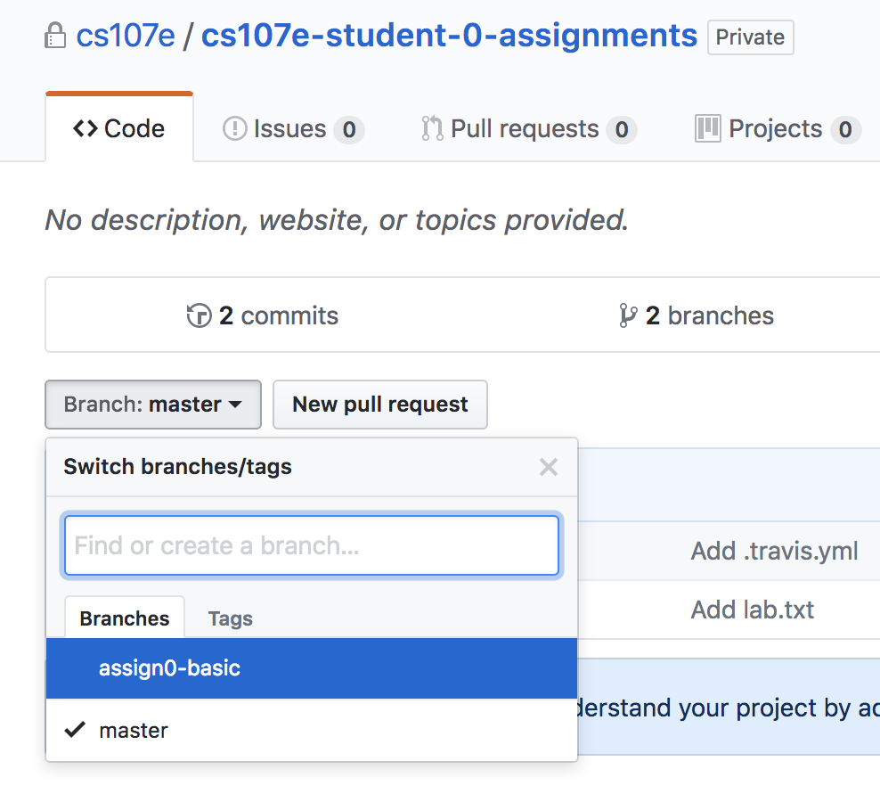

*Written by Omar Rizwan*

**Deadline:** Thursday, September 27, 2018 at 12:00 PM

**No late days can be used on this assignment.**

*Welcome to CS107E!*

## Goals

We have two goals for this assignment:

1. You'll tell us which lab section you prefer.
   (This'll be your 'solution' to the assignment.)

1. We'll make sure that you know how to download an assignment, check
   in your solution, and submit it to us for grading.

This assignment will introduce you to the basics of
[Git](https://en.wikipedia.org/wiki/Git_(software)), the [version control
system](https://git-scm.com/book/en/v2/Getting-Started-About-Version-Control)
that we will be using throughout the course to keep track of your work. Our
Git repositories will be hosted on [GitHub](https://github.com/).

Version control systems are widely used for software development in industry as
well as in the open source and academic communities.  These tools enable teams
of programmers to write code in a distributed setting and send it to a central
repository for review and use.  Alongside keeping a log of changes to the code,
version control systems support the resolution of conflicts introduced by
multiple changesets (e.g. two people trying to edit the same lines of the same
file).  Web interfaces like GitHub promote the practices of code reviews, where
other team members will review proposed changes to check for bugs and provide
feedback on the design and implementation.  The version control skills that you
will learn in this course will be invaluable for any future software projects
that you decide to work on.

## Prerequisites

This assignment assumes basic knowledge of the UNIX command line using an
operating system such as Linux or macOS including how to edit a text file.

Students using windows are required to set up [a Linux virtual
machine](/guides/vmware) for all the assignments in this course (including this
one).

See the [UNIX guide](/guides/unix) for more information about these topics.
Those new to UNIX or wishing to brush up their skills may want to check out the
library of [introductory unix videos/guides](http://cs107.stanford.edu/unixref)
maintained on the standard CS107 web site.

Students are expected to be familiar with the material covered in the [course
guides](/guides) which includes information about hardware and the Raspberry Pi
(we will start working with this in week 2). 

## Steps

### 0: Set up your development environment
First, we will set up a directory to hold all the files that you will be using
for this course. You can create this directory anywhere, but this writeup will
assume that you are doing it in your home directory.

```
$ pwd
/Users/student
$ mkdir cs107e_home
$ cd cs107e_home
```

Next, download the courseware repository: `cs107e.github.io`.  This repository
contains the lecture material as well as common files that we distribute for
labs and assignments.

```
$ pwd
/Users/student/cs107e_home
$ git clone https://github.com/cs107e/cs107e.github.io
Cloning into 'cs107e.github.io'...
$ ls
cs107e.github.io
```

Now we will run the setup script provided in the courseware repository to
configure your development environment. This script assumes that you are
using the `bash` shell. If you are using a different shell, please contact a
CA to get help.

```
$ echo $SHELL
/usr/bin/bash
$ source ./cs107e.github.io/cs107e/bin/setup.sh
```

To validate that the setup worked, run the following commands. You should see
an output similar to what is shown (note that your `PATH` variable may contain
many other entries). If not, contact a CA for help, as setting up your
environment will be crucial for building and installing all the code in the
course.
```
$ echo $PATH
...:/Users/student/cs107e_home/cs107e.github.io/cs107e/bin:...
$ echo $CS107E
/Users/student/cs107e_home/cs107e.github.io/cs107e
```

### 1: Configure Git

Follow [these
instructions](http://git-scm.com/book/en/v2/Getting-Started-Installing-Git) to
install Git on your Mac or Linux machine

Open a terminal window (e.g. Terminal.app on macOS) and enter the following
commands.  Each command begins with a prompt character `$ `, followed by a text
string. Your open terminal should also have a (possibly different) prompt
character. To enter a command, type the entire string the follows the prompt
character `$`.  These commands configure Git with your identity, which will be
associated with the commits (code changes) that you make.

(Replace `My Name` and `myemail@stanford.edu` with your own.)

```
$ git config --global user.name "My Name"
$ git config --global user.email myemail@stanford.edu
```

At this point, you can also change the default text editor for handling Git
commands (e.g. when writing a summary of your code changes). For example, if
you prefer Emacs:

```
$ git config --global core.editor emacs
```

Use the following command to verify that you have correctly updated your Git
configuration.

```
$ git config --list
...
user.name=My Name
user.email=myemail@stanford.edu
```


### 2: Get started with GitHub

This classes uses GitHub to host all the assignments. Students will use GitHub
to download assignments and upload their own solutions for grading.

When enrolling for this course, you should have provided us with your
[GitHub](https://github.com) username.  Each student will be given a private
repository inside the [CS107e organization](https://github.com/cs107e) to use
for assignments.  Once we have set up your repository, you will receive an an
email invitation from GitHub which indicates that you are ready to move on to
the next step.

### 3. Download 'starter code'

**Note**: For the rest of this assignment, **replace all instances of
`[YOUR-GITHUB-USERNAME]` with your GitHub username**.

To confirm that your personal assignment repository has been properly
initialized, visit:
`https://github.com/cs107e/[YOUR-GITHUB-USERNAME]-assignments`


To begin, clone your personal repository.

```
$ git clone https://github.com/cs107e/[YOUR-GITHUB-USERNAME]-assignments assignments
remote: Counting objects: 3, done.
remote: Total 3 (delta 0), reused 0 (delta 0), pack-reused 3
Unpacking objects: 100% (3/3), done.
Checking connectivity... done.
```
This `clone` command will download the starter code into a new folder called
`assignments`. You'll do your work inside that folder. 
**NOTE**: You may have to type in your GitHub username and password to perform
the clone. To work with GitHub without supplying your username or password each
time, follow [these
instructions](https://help.github.com/articles/connecting-to-github-with-ssh/)
to setup an SSH connection.

Next, run the command `cd assignments` to descend into the assignment folder,
and run `ls` to see show the contents of the directory. There should be just
one starter file: `lab.txt`.

```
$ ls
lab.txt
```

### 4. Indicate your lab preference

To begin working on your assignment, you will create a **new** branch called
`assign0-basic`. Future assignments will follow this same naming conventions: a
number for the assignment, and a suffix `-basic` or `-extension` for basic and
extension submissions. For example, your assignment 7 extension should be done
in the `assign7-extension` branch.

To create a branch `assign0-basic`, first, verify that you are in the master branch
with the following command:
```
$ git status
On branch master
```

Then, use the `checkout` command with the flag `-b` to create a branch
<!-- TODO (leonardt 2018-3-18): We could teach them git checkout --track
origin/assign0-basic, but I had trouble coming up with wording to explain the
concept of tracking remote branches succinctly.  -->
```
$ git checkout -b assign0-basic
Switched to a new branch 'assign0-basic'
```

There are two lab sections that meet every week of the quarter:

- Monday, 1:00-3:00 PM
- Friday, 9:00-11:00 AM

Open `lab.txt` in your favorite text editor and replace the contents with one
of the following four options. **Make sure you use the exact same text**.  Your
submission will be processed by an automated tool that expects these exact
strings. For example, if you have preference for Monday but could go on Friday,
`lab.txt` should have one line that says `Monday`. If you can only make Friday,
then the file should hold a single line that says `Friday, can't make Monday`.

- `Monday`
- `Monday, can't make Friday`
- `Friday`
- `Friday, can't make Monday`

Save the file.

### 5. Commit your change

Git should now recognize that you have made a change to the starter code.
Verify this by running `git status`:

```
$ git status
On branch assign0-basic
Changes not staged for commit:
  (use "git add <file>..." to update what will be committed)
  (use "git checkout -- <file>..." to discard changes in working directory)

	modified:   lab.txt

no changes added to commit (use "git add" and/or "git commit -a")
```

Now you will *commit* your changes to save the current state of the repository.
Git records a log of *commits*, with each commit pointing to a different state
of the repository.  A *commit* log provides a history of changes to the code,
akin to different versions of the code, and is the foundation for the more
advanced uses of Git as a *version control system*.

Git will only commit changes to files that have been previously *staged*. This
feature allows users to selectively record changes to the code.  For example, if 
two files have been edited, the user may decide to only commit changes to one file.
In this case, the user would only stage the file of interest before committing,
and changes to the other file will not be included.

To stage the `lab.txt` file, run the `git add` command:

```
$ git add lab.txt
```

We can now verify that Git will include the `lab.txt` changes in the next
commit:

```
$ git status
On branch assign0-basic
Your branch is up-to-date with 'origin/assign0-basic'.
Changes to be committed:
  (use "git reset HEAD <file>..." to unstage)

	modified:   lab.txt

```

Finally, commit your change with a short description of what exactly you did to
the original code:

```
$ git commit -m "Entered my lab preference."
[assign0-basic 019f726] Entered my lab preference.
 1 file changed, 1 insertion(+), 1 deletion(-)
```

Here the `-m` flag indicates to Git that the following text string should be
used as the commit message. Alternatively, you could run the command `git
commit` without the `-m` flag and Git will open a text editor which you can use
to record a commit message. In the future, you will likely use this feature for
longer commit messages that may describe a more complex set of changes. In
practice, good commit messages contain a short (under 50 character) summary of
the changes on the first line, followed by a more thorough description of the
changes.  Detailed commit messages enable programmers to look back in the
history of changes to better understand when and why parts of the code were
changed.

Good commit practices give programmers the ability to navigate the history of
code changes, as well as providing the opportunity to revert to previous
versions.  Sometimes you may find that you want to revert to a commit before a
set a changes that introduced a bug in your code.  The more you commit, the
more opportunities you will have to restore previous working states without
losing as much work.  **We recommend that you commit often and that you write
detailed commit messages.**

### 6. Push to GitHub

The previous Git commands created a branch and recorded the changes to a local
copy of your repository.
<!-- TODO (leonardt 2017-12-13): Could be a good spot to discuss
**distributed** version control, with local mirrors and the concept of
remotes-->
Next, the new branch and changes will be pushed to GitHub so that the online
version of the repository matches your local copy. This gives the course staff
access to your changes for grading. To do this, you will us the command `git
push` as follows. Note that specifying `-u origin assign0-basic` tells git to
push your newly created branch to the remote copy of the repository. You only
need to do this once for new branches (that is, for the subsequent push later
in this assignment, it's sufficient to use `git push` without the extra
arguments).

```
$ git push -u origin assign0-basic
Counting objects: 3, done.
Delta compression using up to 2 threads.
Compressing objects: 100% (1/1), done.
Writing objects: 100% (3/3), 265 bytes | 0 bytes/s, done.
Total 3 (delta 0), reused 0 (delta 0)
To https://github.com/cs107e/your-username-assignments.git
 * [new branch]        assign0-basic -> assign0-basic
Branch 'assign0-basic' set up to track remote branch 'assign0-basic' from 'origin'.
```

To verify that the `push` command worked, go to your assignment repository at
`https://github.com/cs107e/[YOUR-GITHUB-USERNAME]-assignments` and check that
you can see your changes:

**Note:**  This page will show `Branch: master` by default, to see the code and
changes for a specific assignment portion, you will need to manually change to
the appropriate branch using the `Branch` drop down menu:




### 7. Answer background questions
Create a file called `background.txt` that contains answers to the following
questions.  Responses to these questions will be graded by a human, so no need
to follow strict formatting requirements.  However, please ensure that your
responses are clearly labeled (i.e. we know what question it correspond too)
and reasonably organized.

1. What is the result of performing a bitwise OR of the following two
   hexadecimal numbers (include the result in decimal): 0x0f OR 0xff. Now left
   shift that number by 24; what is the result in hexadecimal?

2. How many milliamperes of current will flow through a 1.5K resistor connected
   to 3V on one end and 0V (Ground) on the other end?

3. Find a file in the directory /etc on your computer; send us the name of the
   file and the number of bytes contained in that file. How many files and
   directories are contained in /etc? Include the commands you used to
   answer these questions.

Use the `git` commands you learned in the previous steps to stage this file and
commit it to your local repository. Then, push your changes to your GitHub.

### 8. Create a pull request (submission)

In this course, assignment submission is done using GitHub's _pull request_
feature.  Pull requests provide a summary view of changes made to the code as
well as a section for comments where course instructors will be providing
feedback.

The pull request model is used by many modern software projects to promote good
practices when working in a distributed development environment. The typical
flow starts with a base branch (often called *master*) that reflects the master
copy of the code. Feature development or bug fixing occurs by creating a new
_branch_ where changes are made, followed by the submission of a _pull request_
to the original base branch. Team members use the pull request to review the
proposed changes and provide comments. Once the changes have been approved,
they are merged back into the base branch. In this class, we use a similar
model, except a grader will be reviewing your code and the base branch is the
starter code.

Open the assignment repository page in your browser and make sure that it is on
the branch `assign0-basic`.  Alternatively, go directly to the appropriate page by
using the url
`https://github.com/cs107e/[YOUR-GITHUB-USERNAME]-assignments/tree/assign0-basic`.

Click the 'New pull request' button.


Now you will see text entry boxes for describing the pull request, followed by
a list of the commits that you have made and a line-by-line comparison (`diff`)
of the changed files.

Set the Title to "Submit assign0 basic" and leave the description blank (for
future assignments you can include comments for your grader in the
description).


Click 'Create pull request', which will submit the pull request and take you to
a page to view it:


There is a section indicating whether our automated checks have passed.  You
may need to wait a minute or two and refresh if have not finished.  If the
checks have passed, you will see a green checkmark and a message: "All checks
have passed". If the checks did not pass, make sure you have inserted a valid
choice in `lab.txt` (one of the four choice we provided) and added a 
`background.txt` with answers to the background questions.

Each assignment has a set of automated checks that will be run upon submission.
To see more about the results, click on the 'Details' link.  For this
assignment, the check just verifies that `lab.txt` contains one of the four
valid choices and that the `background.txt` file exists.

The pull request page will update to reflect any changes that are pushed after
the initial submission (e.g. to fix any errors the checker detected).  This
page will also be used by graders to provide feedback on your submissions.

**Note**: The **time of the last commit you push onto the pull request**, not
the time you clicked 'Create pull request', will be considered your time of
submission for deadlines and late days. For example, creating a pull request at
11:59 and pushing an extra commit at 12:01 to fix an error from the autochecker
is considered a day late.

## Afterward: Grader's code review

Graders will review code by including line-specific and general comments on the
pull request page:


Click the 'Files changed' tab to see your whole solution from top to bottom,
along with any inline comments that the grader has added.


When finished with their review, the grader will click the Merge button
themselves. This is similar to how a coworker would merge a pull request when
they are satisfied with the quality of the code changes that you have proposed.
