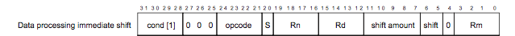

*Written by Pat Hanrahan; updated by Julie Zelenski and Philip Levis*

**Due: Wednesday, Oct 24, 2018 at 11:30 AM**


## Goals

Libraries are critical in software development. They let you build
on existing, well-designed, and well-tested abstractions.
Many of the C standard libraries are
surprisingly large. Because we  copy our entire program over a slow
serial line to the bootloader, we want to have simpler versions of these libraries
that implement a limited subset of features.  

A library for outputting formatted text is particularly valuable,
since printing program state is a valuable form of debugging. In C, the
standard function for outputting formatted text is `printf`. The standard
C `printf` has many options and is pretty big in terms of code size.  Plus,
we want to build our own system from the ground up, and not rely on existing
libraries.  Therefore, you'll be implementing a
pared-down but still highly useful version of `printf`. To break this
problem into smaller, easier to debug, and simpler pieces, you'll
also implement some supporting functions in the `strings` and `printf` modules.
When you've completed this assigment, you'll have added modules for string-handing
and formatted printing to your growing library of Raspberry Pi functions. 

In addition to having an extremely useful library going forward, by implementing these
functions you'll learn:

- how to decompose a complex programming problem into smaller and easier pieces,
- how strings and characters are represented and manipulated in C,
- how to convert basic C types (numbers, pointers, ...) to a string representation,
- how to reuse your GPIO and timer code from the previous assignment, and
- how to use the UART library shown in class to communicate with your laptop.

## Advice

This is a difficult assignment, so...

  1. **Start early**. It's easy to get stuck on a
single bug for several hours. Starting early will prevent you from stressing out
as the deadline approaches and you're fighting a particular tough bug.
  1. **Follow good development and debugging techniques**, just like you learned in lab. 
They will greatly help you complete the assignment faster. 
  1. **Include [tests](#testing) as you go**; spending 10 minutes to write a test
  can save you hours of debugging time later.
  1. **Commit your code to git often**, so that if you modify your code and break 
it you can easily go back to a working version. 
  1. **Decompose your code into simple, clearly-defined
functions.** Your code will be easier for you to debug and easier for
your graders to understand.  There are no absolute length requirements, but as
a guideline, the cleanest versions from previous years have included
10-15 functions and 200-300 lines of code.

## Get started

Navigate to your copy of the `cs107e.github.io` repository and do a `git pull`
to ensure you have the latest files.  

Like in assignment 2, your basic branch has been created for you, so you just need
to fetch the latest copy of the remote repository and checkout the branch:

```
$ cd cs107e_home/assignments
$ git fetch origin
$ git checkout assign3-basic
```

The `assign3-basic` branch that was created for you will contain the `gpio.c`
and `timer.c` files from your last assignment (if you submitted an extension,
the files will be from your extension submission).  If you intend use this
code, read the `Makefile` for more information on how to reuse modules written
for previous assignments.

The starter code contains the modules `printf.c` and `strings.c` (mostly-empty
to start) and the application programs `apps/print.c` and `tests/test_print.c` which are used to
exercise the functions in the modules.

You will edit the `strings.c` and `printf.c` files to implement the required
functions.  You will also edit `tests/test_print.c` to add testing code to check your
implementation.  The `apps/print.c` contains a sample program that exercises the
modules. **Do not modify `apps/print.c`, as doing so means we can't be sure that your
assignment solution conforms to the interface we expect.**

## Basic section

### Strings module
Every general purpose programming language supports a string data type and operations. 
In C, a string is a pointer to a contiguous sequence of characters terminated by a null character (zero, or `\0`). You can access individual characters using pointer or array operations and that's about it. In order to do anything more useful with a C-string, such as find its length, make a copy, or compare one to another, you need to add functions for these operations.

Implementing `printf` is a big task, so you will build up to it by decomposing the
problem into smaller parts. The first is implementing some 
string manipulation functions for the `strings` module in the file `strings.c`.  The
[strings.h](https://github.com/cs107e/cs107e.github.io/blob/master/cs107e/include/strings.h)
header file declares a string functions that will be useful to you now
(in implementing `printf`) as well as in the future. The functions you are to
write are:

- `memset`
- `memcpy`
- `strlen`
- `strcmp`
- `strlcat`
- `strtonum`

Refer to the `strings.h` header file for the behavior of each
function.  Importantly, although these interfaces are modeled after the
standard C library, there are some simplifications. Please carefully read
`strings.h` to ensure you implement what is expected!

The strings exercise at the end of [Lab 3](/labs/lab3/) examined the functions `strlen` and `strcpy`. You are welcome to use that code as you implement these additional string operations.

Read our [advice on testing](#testing)! Trying to implement `printf` on top of a module 
that is not reliable and well-tested will make the task so much more difficult, because
it will be hard to pinpoint where the bug is occurring. Implementing `printf` on top of
a bulletproof strings library, in contrast, is much easier.


### Printf module

Once you have a set of well tested string operations, you're ready to tackle `printf`.

The functions in this module produce formatted output. Each function accepts the same type of format strings with the same conversions, but differ slightly in how they are called or where the output is written.

You're code will be written in `printf.c`, and the header file
[printf.h](https://github.com/cs107e/cs107e.github.io/blob/master/cs107e/include/printf.h)
contains the documentation. The functions you will implement are:
- `snprintf`
- `vsnprintf`
- `printf`
- These two helper functions are not declared in the header file, but are expected to be part of your implementation:
  - `unsigned_to_base`
  - `signed_to_base`

We recommend you start by implementing the helper functions that convert integers to strings, 
then move on to `snprintf`, `vsnprintf`, and finish with `printf`. We give this advice to give
you a example of what it looks like to break a complex problem into smaller parts for easier
testing and development. Be sure to read the 
following sections before starting your implementation, as we detail some important requirements 
as well as provide advice on how to design your solution.


#### 1. Integer to string conversion

 ```c
 int unsigned_to_base(char *buf, int bufsize, unsigned int val, int base, int min_width);
 int signed_to_base(char *buf, int bufsize, int val, int base, int min_width);
 ```

These helper functions handle the task of converting a number to a string representation,
for example, converting the number 0x85 to the string "133".

The caller passes the arguments `buf` and  `bufsize`. `buf` points to a character array where 
the function should write the string. `bufsize` is the size of this array. You can assume 
that `bufsize` is not negative. Your functions should never write past the end
of the array. If the output cannot fit, truncate it. Don't forget that you also need
space for a null terminator.

The `val` argument is the integer value to be converted to a string.
In the `signed` function, if the value is negative, you will
need to include a leading minus sign in the string.

The `base` argument controls the base the string is written in. You have to support
decimal (base 10) and hexadecimal (base 16). When you implement the conversion, do
not copy/paste to create two nearly identical conversion functions, one for each base! 
You want to minimize repeated code, because if you find a bug you'll have to fix it in
both copies. Instead, identify how to, with a single implementation, flexibly allow for 
either base.  Similarly, although there is both a signed and unsigned conversion function, 
you should also not duplicate code between the two. Instead consider how you can call 
the `unsigned` function from the `signed` function.

The `min_width` is the minimum number of characters in the output string.  If 
the formatted string is less than `min_width`, pad the
beginning of the string with zeros so it has length `min_width`. If the 
formatted string is already at least as long as `min_width`, ignore the `min_width`
argument. The minus sign should precede the zero padding and is included
in the `min_width`. You can assume `min_width` is not negative.

The string your function writes into `buf` must be a valid, null-terminated C string. 

These functions should return the count of characters written to
`buf` if there is room to fit them all. If not, it should return
the count of characters that would have been written if there
were room. The null terminator is not included in the count. 

Some invocation examples (`'\0'` is the null terminator):

  * `signed_to_base(buf, 20, 94305, 10, 0)` writes 6 bytes into `buf`: `"94305\0"` and returns 5.
  * `unsigned_to_base(buf, 20, 128, 16, 6)` writes 7 bytes into `buf`: `"000080\0"` and returns 6.
  * `signed_to_base(buf, 5, -9999, 10, 6)` writes 5 bytes into `buf`: `"-099\0"` and returns 6.

**Note about bufsize and memory corruption:**
You might notice that some of these parameters overlap in what they specify about
the output string. For example, `bufsize` is a hard upper limit on how much space is 
available to store the output string, but nothing in the calling convention says that
`min_width` must fit within `bufsize`. In all cases `bufsize` wins: not writing past
of the array and corrupting memory is more important than writing out the string specified
by the arguments.  If `bufsize` is too small to fit your output, even if `min_width` says you 
should go past it, you must cut your output off and make `buf[bufsize - 1]` a null terminator. 
Finally, `bufsize` can be zero: if so, you should not write anything to the buffer, not even a 
null terminator.

__Test as you go!__
Remember that it is easier to debug small steps than large changes,
so make sure these functions are working before you move on. There are many 
different cases to cover, don't be shy about adding a lot of tests into `test.c`. 

#### 2. Implement `snprintf` 


```c
int snprintf(char *buf, int bufsize, const char *format, ... );
```

The `printf` family of functions use what are called "formatting strings" to allow you to combine together different kinds of values into a single string. Look at the [C++ reference](http://www.cplusplus.com/reference/cstdio/printf/#example) for some examples of using `printf`. By default `printf` prints to your terminal and `snprintf` instead "prints" to a string buffer. For more information about printf or other C functions, you can type `man snprintf` to bring up its man page, but bear in mind that your implementation supports a more limited set of options than the full-featured standard library version.

A basic formatting code takes the form of `%z`, where `z` is a character that specifies
the format of the output.  Your implementation must support these five formatting codes:

```
 %c   single character
 %s   string
 %d   signed decimal integer
 %x   unsigned hexadecimal integer
 %p   pointer
```

Each formatting code is paired with an argument passed to `printf`, in order. The first
formatting code is paired with the argument following the formatting string. The second
formatting code is paired with the second argument following the formatting string. 

The basic operation of `snprintf` is to traverse the format string, copy literal characters unchanged to the output string. If it detects a formatting code, it does the appropriate conversion of the assocated argument to string form. No actual processing is need to "convert" characters and strings, so those are straightforward: copy the character or string argument to the output string. To convert an integers to a string, you have your handy `unsigned_to_base` and 
`signed_to_base` helper functions. Pointers are just a special kind of integer (details below).

The integer formatting codes (`%d` and `%x`) allow an optional
width, such as `%03d` or `%05x`. The width specifies the minimum number of characters in the converted string. The width is a nonnegative decimal number and must have a leading 0.

For example, `"%014x"` outputs its unsigned integer argument as a hexadecimal string of at least 14 characters (padded with zeros on the left as necessary). You do not need to support width for the other formatting codes.

The `%p` format outputs an address as a width-8 hexadecimal string prefixed with 0x, e.g. `0x20200004`. Think about how you can reuse your integer conversion functions to implement this 
easily and simply.

The `snprintf` function takes a variable number of arguments, one argument for each formatting code in the format string. To access those additional arguments, you use C's `<stdarg.h.>` interface. Read more about [Variadic functions](#varargs) further down in this writeup.

The return value from `snprintf` is the number
of characters written if they fit in the buffer  or the number of characters
that would have been written if there were room. Again, `bufsize` is the
buffer size that you're allowed to write to, and you should
null-terminate your output.

For simplicity, you can assume that you will never output a string of length greater than 1024 characters (regardless of the size of the destination buffer). If you allocate a temporary buffer of the maximum size and write the full string into it, you can then copy what you need into the final destination as a way to neatly handle the truncation case.

Trying to implement this part of the assignment all at once is extremely difficult. It will
easily lead to a mess of complicated code that is hard to debug or get right. It is
much easier if you decompose it into smaller problems, which you solve one by one. That way,
once you've implemented and tested part of the solution, you can build on top of that. Think
about how to decompose the problem and test it bit by bit. For example, you can start by
implementing `snprintf` that does not support any formatting codes, just outputs the format
string. You can test it with simple examples such as `snprintf(buf, BUF_SIZE, "Hello, World!")`. 
Next, add formatting codes one by one. Which formatting code is easiest to start with? In
your test program, add more tests one by one, so that when you rerun your tests you'll see
if you accidentially broke some existing functionality.
Check out the function `test_snprintf` in `tests/test_print.c`.

Having a working `snprintf` is the big hill to get over in this assignment. Once you have
a working snprtinf, building up the rest of the assignment is a set of simple layers.

#### 3. Refactor into `vsnprintf`

```c
int vsnprintf(char *buf, int bufsize, const char *format, va_list args);
```

The `printf` function needs much of the functionality in `snprintf`. However 
since `snprintf` takes a variable number of arguments, you cannot call it directly 
from `printf`:  Thus you will need to create a shared helper function `vsnprintf` (that takes a
`va_list` parameter), which you can then call from both `snprintf` and `printf`.
Refactoring means moving most of your `snprintf` code into `vsnprintf` and then changing `snprintf` to call `vsnprintf`. Once you have completed this refactor, make sure you are still passing all of your
`snprintf` tests.

#### 4. Implement `printf`
Finishing off `printf` is now a piece of cake. All the function needs to do is declare a stack array of the maximum output length (1024), call  `vsnprintf` to write the formatted string into the array, and call `uart_putchar` to output each character.

```c
int printf(char *format, ... );
```

By now, you should be familiar with testing your code step by step. Hopefully you
have been writing mini-tests all along to verify your functions.

This given tests in `apps/print.c` and `tests/test_print.c` only tests basic `printf` functionality,
so make sure you should add your own tests as well.
You should include at least one
test for each type of `printf` argument (`%c`, `%s`, `%p`, `%d`, `%x`). For example, such tests might look like

```c
printf("%d = -5\n", -5);
printf("%p = 0x20200008", FSEL2);
printf("%04x = 00ab\n", 0xab);
```

Also make sure you add tests for unusual cases. What happens if you try
`printf("")`? What about `printf("\n")`? 

<a name="varargs"></a>
## Variadic functions 

`printf` and `snprintf` are functions that take a variable number of arguments.
C has standardized the way to access variadic functions using the `stdarg.h` interface.
Here is an example.

```c
#include <stdarg.h>
#include <stdio.h>

int sum(int n, ...)
{
    int result = 0;
    va_list ap;

    va_start(ap, n);
    for (int i= 0; i < n; i++)
        result += va_arg(ap, int);
    va_end(ap);

    return result;
}

int main(void)
{
    printf("%d\n", sum(4, 100, 0, 5, 2) );
    printf("%d\n", sum(2, -1, 1));
    return 0;
}
```

The function `sum` has one fixed argument `n`, followed by some number of
additional arguments, indicated by the `...` in its parameter list.  In
general, variable-argument functions still require at least one fixed argument.
For example, the call `sum(4, 100, 0, 5, 2)` contains one fixed argument, 4
(number of values to sum), and four additional arguments, 100, 0, 5, and 2.

The implementation of the  `sum` function demonstrates how to use `stdarg.h`. 

The variable `ap` is declared of type `va_list`.  This variable is initialized
using `va_start`, which is passed the last named argument. In this case, we
tell `va_start` that `n` is the last argument before the variable arguments
begin.

Then we loop over the `n` arguments, fetching each argument using `va_arg(ap,
type)`. In the `sum` example, the variable arguments are all of `int` type, but
the type can be different per-argument by changing what type is used in
`va_arg`. When we are done processing all of the variable arguments, we call
`va_end(ap)` to clean up after ourselves.

Note that because of obscure rules in the C standard about "[default argument
promotions](http://stackoverflow.com/questions/1255775/default-argument-promotions-in-c-function-calls)",
you cannot ask `va_arg` for the `char` type. Instead you must ask it for an
`int` and then cast the `int` to a `char`.

For additional information about `stdarg`, read the [Wikipedia page on
stdarg.h](http://en.wikipedia.org/wiki/Stdarg.h).

<a name="testing"></a>
## Testing, testing testing! 
Students who struggled in the past generally wrote too much code
before testing it. Try to implement this assignment in little
increments, making a small, testable improvement each time. If it
doesn't work, you'll at least know exactly where to find the mistake.

__We strongly recommend that you follow a "test as you go" strategy!__ As you write each function, immediately turn your attention to testing it. 

We provide a few tests to get you started in `tests/test_print.c`. Passing the given tests is a good first step, but these simple tests are far from sufficient. Part of your job is to review `tests/test_print.c` to understand what is provided and brainstorm what additional tests are needed to thoroughly vet your functions. Edit `tests/test_print.c` to add those test cases and verify that your implementation passes all those tests before moving on to the next function.

Never delete a test! Sometimes a test that you passed earlier will regress due to later changes. If you have removed the test case, you may not realize the bug has resurfaced. Just keep accumulating tests in `tests/trest_print.c` as you think of new cases to try and then each run of your test can validate you are passing your entire suite.

One unfortunate circularity with trying to test a printf implementation is the
lack of a working printf to help you debug.  Here are a couple of strategies
that don't involve `printf` that you may want to consider:

- Liberal use of `assert()` tests. For example, you might test the output
  written by `signed_to_base` matches the expected output by asserting the two
  strings `strcmp` as equal.
- Run your program under gdb in simulation mode and use gdb's facilities to
  step and print variables to observe your program's operation.

Alternatively, the `libpi.a` that we have provided you comes with an
implementation of `printf`! You can use this `printf` to debug your
implementation by changing the name of all the functions in `printf.c` (e.g.
adding a `my_` prefix, such as `my_printf`).  **NOTE:** you should also update
your testing code to call your renamed functions (e.g.  `my_printf`), and use
the normal `printf` in places where you'd like to debug.  For example, in
`tests/test_print.c` you might call `my_printf` to test your code, and within your
`my_printf` implementation, you might call `printf` to read out internal values
for debugging. **WARNING:** Our implementation of `printf` will use your
implementation of the functions in `strings.c`. You should be certain that your
implementations are well tested for this path to work.


## Other advice
- We encourage you to get into the habit of making regular commits (via `git add` and `git commit`). As you progress, each time you reach any sort of milestone (completed a function, fixed a bug, etc.) make a commit with a message that reminds you of where you are at. If something breaks later on, you can always return to this known-good state.
- Our module interfaces are deliberately slimmed down from the standard library in order to allow you to make simplifying assumptions. You should further more assume that all inputs will conform to the required specification: e.g. only these 5 formatting codes, base is always be 10 or 16, the width specified must begin with a zero, the width will never be negative, the format string is well-formed and so on. You do not have to detect/handle/reject any calls that violate these assumptions, we will not test on such inputs. 

## Extension: disassembler
The assignment extension is to put your shiny new `printf` to work in writing a program that can disassemble itself. The binary-encoded instructions for the currently executing program are stored in memory starting at address `0x8000`. Each instruction is encoded as an unsigned int. Here is a diagram of the bitwise breakdown for a data processing instruction:



Reading from left to right, the upper four `cond` bits indicate conditional execution, the next three bits are `000` indicate this is a data processing instruction with an immediate operand 2, the four `opcode` bits determine which kind of operation (add, subtract, etc), the `S` bit determines whether the flags are set, and so on. 

In class, you may have played the role of _assembler_ by translating an instruction such as  `add r3, r4, r5` into `e0843005`. The reverse process is a _disassembler_ which picks apart the bits of the encoded instruction `e0843005` to print out `add r3, r4, r5`.  The extension is to automate this disassembly process and produce output like that shown below:

    ...
    0x00008074: e0 43 30 05    add r3, r4, r5
    0x00008078: eb 00 01 c9    bl 87a4
    ...

You _could_ use your bit-masking superpowers to pick apart an encoded instruction but a simpler way is to define a C bitfield. Open the file `disassemble.c` given in the starter code to see an example.

Your extension should be capable of decoding the most common variants of the data processing and branch instructions. The ARM instruction set has a remarkably regular encoding, so you can catch a good chunk of all instructions with just a few cases. If you want to get fancier, try decoding load/store and load/store multiple (i.e. push and pop).

Refer to the [ARM ISA documentation](http://cs107e.github.io/readings/armisa.pdf) for details on the instruction encodings. Don't worry about making special cases for oddballs. For any instructions you don't decode, print the encoded value and skip to the next. 

Print the sequence of disassembled instructions starting from address 0x8000 and continuing for 100 instructions or so.  Some of the data you encounter may not be instructions at all (e.g. data values can be intermixed into the instructions). Don't worry about those, just decode the first 100 4-byte values as though each was an instruction. 

Compare your output to the contents of `disassemble.bin.list` (this is the disassembly produced by `objdump`) to see how good a job your disassembler is doing. You just wrote program that dissects itself from the inside -- how awesome is that!

We will offer more credit on this extension as it is a bit harder than the last extension, and a really great implementation will be appropriately awarded!

## Submit and automated checks
Submit the finished version of your assignment by making a git “pull request”.

The automated checks here, as always, make sure that we can run your C
code and test and grade it properly, including swapping your tests for
ours.

CI will automatically check that:

- `apps/print.c` is unchanged

- `make` completes successfully

- `make tests/test_print.bin` completes successfully using your `tests/test_print.c`

- `make tests/test_print.bin` completes successfully using the original `tests/test_print.` from
  the starter code (we will swap this in before running it)

Again, if CI fails on your final submission, we will automatically
deduct 1 point from your basic grade.

Also remember that the automated tester will deduct half a point for any
warnings generated when compiling your code. Warnings are okay while your code
is still in active development (e.g.  prototyping/experimenting), but should be
addressed when your code is stable.  One method to ensure that you have no
warnings generated is to add the flag `-Werror` to the compile command in your
Makefile.  This flag will cause a compiler error when a warning is generated,
and can be added before submission to ensure that no warnings sneak through.
