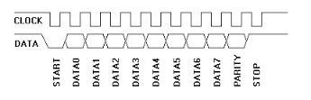
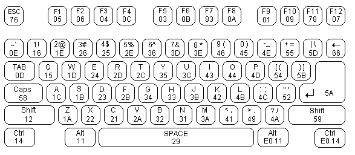

*Written by Philip Levis, updated by Julie Zelenski*

**Due: Wednesday, Nov 7, 2018 at 11:30 AM**


In this assignment, you'll implement a PS/2 keyboard driver and a simple command shell. This is a fun assignment, and brings us back to using physical devices and making them do cool things. With these additions, you are close to turning your humble little Raspberry Pi into a fully standalone personal computer!


## Goals

In this assignment, you will

1.  Build on your scancode reader from Lab 5 to write a keyboard driver
    that correctly translates PS/2 scancodes into ASCII characters.
2.  Connect your keyboard driver to the serial port so that you
    see what you type.
3.  Write a simple shell that reads and executes commands.

## Get started

Navigate to your copy of the `cs107e.github.io` repository and do a `git pull` to be sure you have the latest files from the courseware repo.

As in the last assignment, your `assign5-basic` branch has been created for you. Navigate to your `assignments` directory and check out the new branch.

```
$ cd cs107e_home/assignments
$ git fetch origin
$ git checkout assign5-basic
```

Like all the assignments in the course, this assignment builds on the modules
you have written previously.  Check the files in your `assign5-basic`
(`gpio.c`, `timer.c`, `strings.c`, `printf.c` `malloc.c` and `backtrace.c`) to
ensure that you have the latest copy.  If you have missing changes from a
previous assignment branch (e.g. commits from a regrade submission), merge them
in (e.g. `git merge assign3-extension`). If you implemented an extension for
`assign4`, the `assign5-basic` branch will be based off your
`assign4-extension` branch. If you'd like to revert your `malloc.c` back to
your basic submission (e.g. if there was a bug introduced by your extension
attempt), you can do this with `git checkout assign4-basic -- malloc.c`.  This
checks out the single file, `malloc.c` from the `assign4-basic` branch. You'll
need to stage and commit file.

Consult the `Makefile` for more information on reusing code from previous
assignments. You might want to start by implementing your assignment using the
reference modules in our library.  Once your keyboard driver is working
correctly, swap in your own modules and check that it still works and doesn't
trigger a bug in your code.

<!-- TODO: Update this next quarter, we introduced this new structure mid-quarter -->
The directory structure of the starter files for this assignment has changed
slightly.  The new starter files for this assignment are the libpi modules
`keyboard.c` and `shell.c`, the application program `apps/shell.c`, and a test
program `test/test_keyboard.c`.  

* Instead of the `main.c` we've been using for past assignments, the *main*
  application for this assignment now lives in `apps/shell.c`.  If you inspect
  the `Makefile`, you'll see `APPLICATION = apps/shell`.  That means running
  `make` with no arguments will build `apps/shell.bin` and running `make
  install` will install `apps/shell.bin`.  

* The location of the test file has also changed and can now be found in
  `tests/test_keyboard.c`. Again, if you consult the `Makefile`, you'll see the
  test rule now looks like `test: tests/test_keyboard.bin`, indicating that
  this `tests/test_keyboard.c` will be used to generate a test binary that will
  be installed by `make test`.

Assignment 4 was the first instance of an extension that required changes
that could introduce bugs into your basic code.  If you implemented an
extension for `assign4`, the `assign5-basic` branch was based off your
`assign4-extension` branch. If you'd like to revert your `malloc.c` back to
your basic submission (e.g. if there was a bug introduced by your extension
attempt), you can do this with `git checkout assign4-basic -- malloc.c`.
This checks out the single file, `malloc.c` from the `assign4-basic` branch.
You'll need to stage and commit the file normally.

One final note is that the initial tests in `tests/test_keyboard.c` are not
assertion-based as in previous assignments.  These tests just print what is
returned by your functions. It is up to you to verify that those outputs are
correct. As always, you should extend the test program to include additional tests
of your own.

## Basic part

### Keyboard driver

The  `keyboard` library module you are to implement this week provides a driver for a PS/2 keyboard. The header file
[keyboard.h](https://github.com/cs107e/cs107e.github.io/blob/master/cs107e/include/keyboard.h) documents the routines exported by the module, which are:

+ `keyboard_read_scancode`
+ `keyboard_read_sequence`
+ `keyboard_read_event`
+ `keyboard_read_next`

You'll start by implementing the low level routines that read raw scancodes and then add the mid and top level routines that translate from scancodes into key events and typed characters.

#### 1) Read and validate scancodes

The first two functions you will implement for the keyboard module are the low-level routines that deal with nitty-gritty of the PS2/2 protocol. 

Recall from lab that a PS/2 scancode is an 8-odd-1 packet
consisting of 11 bits. The first bit, the start bit, is low. The next 8
bits are data bits, least significant bit first. The tenth bit is a parity
bit. The PS/2 protocol uses odd parity, which means that there should be an odd number of 1s in sum of the data and parity bits. The 11th and final bit is the stop bit, which is
always high.



Copy in your implementation of `keyboard_read_scancode` from lab,
then extend it to verify the validity of the parity and stop bits. If either the parity bit
or stop bit is incorrect, discard the scancode and try again.

`keyboard_read_scancode` should not return 0 on
failure: instead, it should retry reading a new scancode from the beginning.  It is important to recovery gracefully from transmission errors. Discard as many invalid tries as necessary, just be sure the function returns a valid scancode in the end.

The first test in `tests/test_keyboard.c` can be used to print out scancodes.

**Timing is everything!**: One important consideration to keep in mind is that the timing of the PS/2 protocol has to be strictly followed. The keyboard sends the bits rapid-fire and you need to be prepared to catch each bit as it arrives. Once your driver sees the falling clock edge for the start bit, it needs to stay on task to read each subsequent bit. There is not much time between the falling clock edges! If you call `printf` or attempt some involved task while reading bits, you're very likely to miss a few. Save any debug printing for after you read the entire sequence.

As a follow-on to that last note, a dropped bit or partially read and discarded scancode could lead to your driver becoming desynchronized.  When
this happens, your driver may try to read a scancode byte starting in the middle
of a bit sequence and will expect further bits to arrive that won't be forthcoming. One way to recover rather than get stuck there to have `keyboard_read_scancode` *time-out*. Use
your timer code to detect if the current falling clock edge occurred more than
3ms after the previous one, and if so, reset the scancode reader and
assume the current clock edge is for a start bit. This behavior is not required,
but it's just a few lines of code and adds a nice bit of robustness.


#### 2) Read a key sequence

The next level in the software stack is a function that groups scancodes into a key sequence.
A key sequence corresponds to pressing or releasing one key.

When you press a key, the PS/2 keyboard sends the scancode for that key. When you release
the key, it sends a two-byte sequence: `0xF0` (the "break" code) followed by the key's scancode. For example, typing `z` will cause the keyboard to send scancode `0x1A` and releasing `z` will
cause the keyboard to send `0xF0 0x1A`.

Implement `keyboard_read_sequence()` in `keyboard.c` to read the scancode sequence corresponding to one key action, i.e., the press or release of a single key.

This function should also handle reading the sequence for an extended key. 
Extended keys were extra keys added to keyboards.
These keys code not be represented with 8-bit scancodes.
When an extended key is sent, it takes two bytes.
The first byte is `0xE0` and the second byte is the scancode.
Extended keys also use `0xF0` to indicate that the key has been released.
So, sequences involving extended keys have length 2 or 3. For example,
pressing the right control key will cause the keyboard to send the scancode
`0xE0` followed by `0x14` and releasing will send `0xE0`, `0xF0`, `0x14`.

Use the functions in `tests/test_keyboard.c` to verify you can properly read sequences.

#### 3) Process keyboard events
The mid-level routine of keyboard driver returns key events. A key event repackages the scancode sequence into a structured form-- which key was involved, whether the event is a key up or key down, and what modifier keys (control, alt, shift) are currently in effect.

The function `keyboard_read_event` returns a struct
of type `key_event_t`. This struct is defined in the  `keyboard.h` header file.
The struct fields include the scancode sequence that generated the event,
the length of that sequence,
whether the key was pressed or released (the `action`),
and the current state of all the modifier keys.
The state of the modifier keys is stored in an `unsigned int`.
The `enum keyboard_modifiers` defines bits for different
modifier keys; if this bit is set in `modifier` that means
that the modifier key is currently held down,
or, in the case of `CAPS_LOCK`, is in the active state.
The function `keyboard_read_event` needs to keep
track of the state of modifier keys.

We provide an additional piece of information
in the header file `ps2.h`.
That file contains an array of structs of type `ps2_key_t`.
This array maps each keyboard key (identified by its scancode) to the character(s) that this key produces when typed.

Each key has two character values, 
the unmodified character and the shifted character.
For example, the KEYA maps to `{ 'a', 'A' }` and the 
KEY0 maps to `{ '0', '!' }`.
The scancode for KEYA is `0x1C`, 
so accessing `ps2_keys[0x1C]` will return `{ 'a', 'A' }`. Non-character keys, such as the Escape or Backspace key, are assigned character values greater than 0x90 to distinguish them from ASCII characters.

 The source file
 [ps2.c](https://github.com/cs107e/cs107e.github.io/blob/master/cs107e/src/ps2.c) contains the definition of the `ps2_keys` array. Each entry corresponds to one scan code.
Note that many scancodes do not correspond to keys at all;
those entries are indicated by a special struct `UNUSED`.

Additionally the file `ps2.h` defines various useful constants 
such as `PS2_CODE_RELEASE = 0xF0`, and `PS2_CODE_EXTEND = 0xE0` and codes for the modifier keys such as SHIFT and ALT.
There are also constants for the character values assigned to the special keys
such as HOME and F1.

Use the functions in `test/test_keyboard.c` to verify reading key events before moving on.

#### 4)  Produce ASCII characters

You now have all of the pieces you need to implement the top-level rountine `keyboard_read_next`.  This function returns characters as typed by the user. The return value is an ASCII character in the case of ordinary keys or the designated code from `ps2.h` for a special key such as ESC or F9.

You'll need to implement shift and caps lock.
It turns out that Windows/Linux handle it differently than a Macintosh.
Your code should follow the Macintosh behavior,
since it's better to rely on Apple for better user interface design.
If you are using a Macbook laptop,
you can see what characters are generated
when pressing different keys using the Keyboard Viewer application.
If you're are still unsure how to handle different cases,
try our reference implementation of the keyboard
using the test application from lab.



Your driver should handle all the keys shown in the keyboard diagram above. This includes numbers, letters, and punctuation, the modifier keys caps lock, shift, alt, and control (both left and right modifier keys), and the function keys. Unless you are doing the extension, you do not to process other special keys (arrow keys, numeric keypad, num lock, home, etc.) and can simply discard those key events.

### Shell application
You are now going to put your keyboard driver to use in a simple shell application program that allows you to type in commands and control the Pi without needing to plug another computer into it. A shell, such as `bash` or `zsh`, is a program that serves as a command-line interpreter. The program sits in a loop, reading a command from the user and then executing it. 


#### 1) Review shell interface

Review the interface to the `shell` module in the header file
[shell.h](https://github.com/cs107e/cs107e.github.io/blob/master/cs107e/include/shell.h).
 

`shell_init` takes a _function pointer_ argument that is used to configure where the shell directs its output. Rather than directly call `printf` when it needs to output something, the shell will call the print function it was initialized to use. This allows the shell to be reconfigured for different outputs by supplying a different print function.

The starter code for assignment 5 calls `shell_init(printf)`.  This initialization configures the shell to use the `printf` function to send its output to the serial uart interface.
In assignment 6, when you write code to draw to an HDMI monitor,
you'll instead configure the shell using `shell_init(console_printf)` to route the shell's output to your graphical display via your console function.

The starter code for the `shell_run` function demonstrates the standard read-eval-print loop that is at the heart of an interpreter. Here is that loop expressed in pseudocode:

    loop forever
        display prompt
        read line of input from user
        evaluate command (parse and execute)


#### 2)  Read line

`shell_readline` reads a single line of input from the user. It reads the characters typed on the keyboard and stores them into a buffer. Reading for the current line stops when the user types enter (`\n`).

When the user types backspace (`\b`), the shell should delete the last
character on the current line.  Outputting a backspace character, e.g. `uart_putchar('\b')` , will move the cursor backwards one position. If you back up, output a space, and then back up again, you will have effectively "erased" a character. (Wacky, but it works!) If the line is empty and there is no further characters to delete, use the provided `shell_bell` function to beep instead of attempting to delete a non-existent character.

`shell_readline` is a great way to exercise your shiny new keyboard driver!

#### 3) Parse command line

When a user types `enter`, use `shell_evaluate` to parse the current line as
follows:

+ If the line is empty, skip it, there is nothing to evaluate.
+ Otherwise, tokenize the line into words. A token consists of a sequence of non-space characters. Store the tokens into an array of `char *`. The first token is the name of the command to execute, the subsequent tokens are the arguments to the command.
+ Look up the command function associated with the command name (first token). This lookup uses a "command table" that is described in the section below.
+ If no matching command is found, print an error message `error: no such command 'binky'.`
+ Otherwise, execute the function associated with the command, passing the rest of the tokens as arguments.

We've implemented the `echo` command for you. `echo` simply prints out all
of its arguments. For instance, when a user types `echo Hello, world!` in
the shell, the shell responds with: `Hello, world!`. The session should
    look as follows once you've successfully implemented this tiny shell:

        Pi> echo Hello, world!
        Hello, world!

Be sure to take advantage of the awesome functions you have implemented in your `strings` and `malloc` modules. They will be very helpful here!

Because trying to debug the code that parses a line text into an
array of strings is a bit harder on your Raspberry Pi than on your
laptop, you might want to first write and debug it locally, or use
the ARM simulator in gdb.

#### 4)  Execute command
The 
[shell_commands.h](https://github.com/cs107e/cs107e.github.io/blob/master/cs107e/include/shell_commands.h) file defines a struct to represent a shell command. The `fn` field is a pointer to a function that takes two arguments: `argv` is an array of `char *`, i.e. an array of strings, and `argc` is the count of elements in the  `argv` array. Each command function returns an int which is 0 if the command executed successfully, or nonzero otherwise. There's a starter table of commands in `shell.c` called `commands`. You should modify this table as you add commands to your shell.

Here are the commands you are to implement:

**help**

Without any arguments, `help` should print a list of all available commands
along with their description in the following format:

    Pi> help
    cmd1: description
    cmd2: description

If an argument is given, `help` should print the description for that command,
or an error message if the command doesn't exist:

    Pi> help reboot
    reboot:  reboot the Raspberry Pi back to the bootloader
    Pi> help please
    error: no such command `please`.

**reboot**

This command should reboot your Pi by calling the `pi_reboot` function from the `pi` module of `libpi`. See ya back at the bootloader!

**peek**

This command takes one argument: `[address]`.  It prints the 4-byte value stored at memory address `address`. 

Example (assume address 0xFFFC contains the number 0x12345678):

    Pi> peek 0xFFFC
    0x0000fffc:  12345678

Remember that the strings modules you wrote early contains the handy function `strtonum` to convert strings to numbers. If the address argument is missing or cannot be converted, `peek` should print an error message:

    Pi> peek
    error: peek expects 1 argument [address]
    Pi> peek bob
    error: peek cannot convert 'bob'

One quirky detail to handle is that the ARM architecture is not able to read or write from an unaligned address. A 4-byte value can only be read starting from an address that is a multiple of 4. If the user asks to peek (or poke) at an unaligned address, respond with an error message:

    Pi> peek 7
    error: peek address must be 4-byte aligned

**poke**

This command takes two arguments: `[address] [value]`.  The poke function stores `value` into the memory at `address`.

Example (assume 0xFFFC currently contains the number 0x12345678):

    Pi> peek 0xFFFC
    0x0000fffc:  123456789
    Pi> poke 0xFFFC 1
    Pi> peek 0xFFFC
    0x0000fffc:  00000001
    Pi> poke 0xFFFC 0
    Pi> peek 0xFFFC
    0x0000fffc:  00000000

You should use `strtonum` to implement this command as well.  If either argument is missing or cannot be converted, `poke` should print an error message:

    Pi> poke 0xFFFC
    error: poke expects 2 arguments [address] [value]
    Pi> poke fred 5
    error: poke cannot convert 'fred'
    Pi> poke 0xFFFC wilma
    error: poke cannot convert 'wilma'

Once you've implemented `poke`, you should be able to turn a GPIO
pin on and off just by entering commands!

    Pi> poke 0x20200010 0x200000
    Pi> poke 0x20200020 0x8000
    Pi> poke 0x2020002C 0x8000

Recall the
[BCM2835 manual](http://cs107e.github.io/readings/BCM2835-ARM-Peripherals.pdf#page=90)
and what is stored at the above three addresses. What should each of these
commands do, if `poke` works properly? Hint: the ACT LED on the Pi
is GPIO pin 47. Another hint: see what the second value (the
32-bit constant we want to store) looks like in binary in each case.

Check out the
[Wikipedia article on peek and poke](https://en.wikipedia.org/wiki/PEEK_and_POKE) if you're curious.


## Extension: editing and history

The extension consists of two parts. You should do both parts.

Remember to create an `assign5-extension` branch based off your `assign5-basic`
branch with `git checkout -b assign5-extension` (this assumes you currently
have your basic branch checked out).

1.  **Command-line editing**

    Implement the left and right arrow keys to move the cursor within the current line and then allow inserting and deleting characters at the point of the cursor. What other editing features might be nice to have:  Ctrl-a and ctrl-e to move the cursor to the first and last character of the line? Ctrl-u to delete the entire line? Implement your favorite vim/emacs/editor must-haves!

2. **Command history**

    Number the commands entered starting from 1 and maintain a rolling history of the last 10 commands entered. Change the prompt to include the command number of the current line. Add a `history` command that displays the history of recent commands, each prefixed with its command number. See the example below:

        [1] Pi> help echo
        echo: <...> echo user input to the screen
        [2] Pi> echo cs107e rocks
        cs107e rocks
        [3] Pi> history
          1 help echo
          2 echo cs107e rocks
          3 history

    When entering a command, typing the up arrow key should change the current line to display the command from the history that is previous to the one on the current line. Typing a down array should change the current line to display the command that ran _after_ the one on the current line, or whatever the user had typed until he/she typed up. Use the `shell_beep` when the user tries to move past either end of the history.

    What other history features might be handy? `!!` to repeat the last command? `!ze` to repeat the most recent command matching the specified prefix `ze`?

    If you didn't already know that your shell includes editing and history features like these, now is a great to pick up a few new tricks to help boost your productivity!

If you wrote the disassemble extension for assign3 (or you want to do it now!), a neat option would be to integrate a  `disassemble [addr]`  command into your shell. The fun never stops!


## Submit

Submit the finished version of your assignment by making a git “pull request”.

The automated checks make sure that we can run your C code and test and grade it properly, including swapping your tests for ours.

