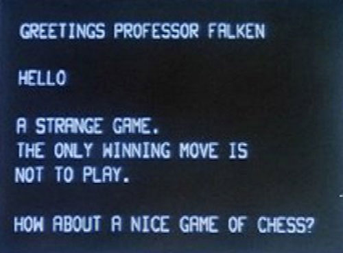

*Written by Philip Levis, updated by Julie Zelenski*

**Due: Wednesday, Nov 14, 2018 at 11:30 AM**



A console is a text interface for entering commands and seeing output.
Today we have powerful shell programs that support scripts, process
control, and output redirection. But simpler consoles can be very
powerful too. One very famous console is
[Joshua in WarGames](https://www.youtube.com/watch?v=ecPeSmF_ikc).

### Goals

Over the next two assignments, you will transform your Raspberry Pi into a standalone 
personal computer with a working graphical console, entirely with bare metal code.

For assignment 6 you will

1. Finish the implementation of the framebuffer module (`fb.c`).

2. Build a graphics library (`gl.c`) of drawing routines, including support for drawing characters using fonts.

3. Build a console module (`console.c`) on top of your graphics library.

4. Port your shell to use the console. This will allow you to run 
the shell standalone without using your laptop.

In the final assignment, you will add interrupt processing,
so you never miss a character 
and the console code uses the processor much more efficiently.

## Get started

Navigate to your copy of the `cs107e.github.io` repository and do a `git pull`
to be sure you have the latest files from the courseware repo.

As in the last assignment, your `assign6-basic` branch has been created for you. Navigate to your `assignments` directory and check out the new branch.

```
$ cd cs107e_home/assignments
$ git fetch origin
$ git checkout assign6-basic
```

Like all the assignments in the course, this assignment builds on the modules
you have written previously.
Check the files in your assignments directory (`gpio.c`, `timer.c`,
`strings.c`, `printf.c`, `malloc.c`, `backtrace.c`, `keyboard.c` and `shell.c`)
to ensure that you have the latest versions.  If you have missing changes from a
previous assignment branch (e.g. commits from a regrade submission), merge them
in (e.g. `git merge assign4-extension`). If you implemented an extension for
`assign5`, the `assign6-basic` branch will be based off your
`assign5-extension` branch. If you'd like to revert your `shell.c` back to
your basic submission (e.g. if there was a bug introduced by your extension
attempt), you can do this with `git checkout assign5-basic -- shell.c`.  This
checks out the single file, `shell.c` from the `assign5-basic` branch. You'll
need to stage and commit file.

Consult the `Makefile` for more information on reusing code from previous
assignments. You are very close to having completed your own versions of all
the modules in the full `libpi` library!

The starter project contains the modules `fb.c`, `gl.c`, and `console.c`.  The
main application program is `apps/console_shell.c`. A starter test program has
been provided in a `tests/test_console_and_gl.c`.  As always, you can extend
the test program to include additional tests of your own.

## Basic section

### 1) Framebuffer

The  `fb` library module configures the framebuffer by using the system mailbox to communicate with the GPU.  The header file
[fb.h](https://github.com/cs107e/cs107e.github.io/blob/master/cs107e/include/fb.h) documents its public functions, which are:

+ `fb_init`
+ `fb_swap_buffer`
+ simple getters `fb_get_width`, `fb_get_height`, ...

The starter version of `fb.c` contains the code from lecture (slightly modified) to initialize the framebuffer. You are to finish the implementation of `fb_init` and complete the other functions in the `fb` module. 

The framebuffer can be configured in either single-buffered or double-buffered mode. If single-buffered, there is only one buffer. All drawing takes place in that one buffer and is immediately displayed. 

If double-buffered, there are two buffers: a 'front' buffer that corresponds to what is currently being being displayed on-screen and a 'back' buffer where you can draw off-screen. When finished drawing into the back buffer, swapping it with the front buffer gives a smooth on-screen transition.

If single-buffered, you will configure the framebuffer's virtual size to be equal to the physical size. To support double-buffering, you will need to create
space for two buffers by setting the virtual height of the buffer
    to be twice the physical height. The lower half corresponds to one buffer and the upper half is the other.
    Make sure to review the lecture slides
    on single and double buffering. 

To swap between buffers, you need to inform the GPU of which part of the framebuffer to display. This involves changing the Y offset from 0 to the
    physical height (or vice versa). This must be done by writing the
    fb struct to the mailbox with the new `x_offset` and `y_offset`. After you do a `mailbox_write` , you must follow up with a `mailbox_read` to acknowledge the GPU's receipt of the message. If you forget to `mailbox_read`, the mailbox queue will fill up and the system eventually hangs.


### 2) Graphics library
The graphics library layers on the framebuffer and provides higher-level drawing primitives that set the color of a pixel, draw filled rectangles, display text, and more. Read the header file
[gl.h](https://github.com/cs107e/cs107e.github.io/blob/master/cs107e/include/gl.h) for documentation of the basic drawing functions:

+ `gl_init`
+ `gl_color`
+ `gl_clear`
+ `gl_draw_pixel`
+ `gl_read_pixel`
+ `gl_draw_rect`

Initializing the graphics library is mostly a matter of making the the appropriate call to initialize the underlying framebuffer. Assume the graphics library always is configured for 32-bit depth. Each pixel stores a 4-byte BGRA color.

To access a single pixel in the framebuffer (such as needed in the implementation of `gl_draw_pixel` or `gl_read_pixel`), it is convenient to use the multi-dimensioned array syntax shown in lecture and reviewed in exercise 3 of [Lab 6](/labs/lab6). Take care that the `width` may differ from the  `pitch`: you want to compute the location of the pixel in the framebuffer based on the pitch, not width, because the GPU may have made each row a little wider than requested for reasons of alignment.

A critical issue to be mindful of when writing these graphics routines is that C provides no bounds-checking on array access. If you mistakenly attempt to draw to a location outside the bounds of the framebuffer, you can step on other memory in active use by the GPU, with various dire consequences to follow. Thus, if asked to fill a large rectangle or color a pixel location not on screen, take care to draw only those pixels that lie within the framebuffer bounds. Drawing a long string should clip off any pixels that are outside the boundary.

The `gl.h` header defines the additional functions `gl_draw_line`
and `gl_draw_triangle` that only are implemented if you are completing the extension.


### 3) Fonts and text-drawing
The final two functions to implement for the graphics library are:

+ `gl_draw_char`
+ `gl_draw_string`

To draw a character, you need some notion of a font. We provide a `font.c` to help with 
this. It supplies character images used to draw text on the screen.
You were introduced to this module during lab  -- it stores the font as a bitmap image
and produces small 32-bit images as requested.
All of the characters in a font are stored in one large contiguous image. 
The `font_get_char` function extracts the image for a single character. 
Each font character is fixed-width and arranged in ASCII order, so some simple math 
allows it to identify which bits to extract from the large image for a given character.

The basic strategy for drawing a character is to obtain its character image from 
`font_get_char` and then draw the pixels in the framebuffer that correspond to the 
"on" pixels in the character image. Drawing a string is just iterating to draw each character. 

Just as you did with your earlier graphics functions, take care that you clip all drawing to the bounds of the framebuffer.

### 4) Console
The console module uses the text-drawing functions of the graphics library to provide an interactive terminal on your monitor. The console has these public functions:

+ `console_init`
+ `console_clear`
+ `console_printf`

The `console_printf` function parallels the existing `printf` routine. Instead of writing the formatted output to the serial uart, the console version draws the output on the graphical display.

Internally, the console tracks a text buffer containing all the lines of text
that are currently on the display, typically using some sort of two-dimensional
array.  The console also keeps track of the current cursor position.
When asked to print a character to the console, you add it to the text buffer
at the current cursor position, increment the current cursor position, and
refresh the display.  If there are too many characters to fit on this row, you
should automatically wrap around to the next line of text.  As you wrap around
on the last line of text (the one displayed on the bottom), scroll the text
upwards, that is, shift all the lines up by one. The top line scrolls off and
the bottommost line now contains the new text.

When processing characters, interpret the following special characters:
    \n :  newline (move cursor down to the beginning of next line)
    \b :  backspace (move cursor backwards one position)
    \f :  form feed (clear contents and move cursor to home position)

Rather than try to write this entire functionality in one go, break it
    up into pieces. For example, start by properly handling a console of just a single line and appending characters to the end of that single line. Once you're able to handle a single line of text correctly,
 think about how you want to represent multiple lines of text.
Walk through (through notes, or just in your head) how you'll
handle newline and scrolling with your approach. Some ways of representing
text will make this much easier than others. We encourage you to talk
with your fellow students to discuss the best data structure to use.
Don't feel bound to one design: if you start implementing your
approach and it starts seeming very difficult, with many hard edge cases,
you may want to consider a new design. Like much code in this class, 80% of
the effort is figuring out exactly what your code should do. Once you know,
it's short and simple to write. So if you have some messy code as a result
of your learning process, don't be afraid to throw it away.

The console module is a layer on top of the graphics
library (which itself is a layer on top of the framebuffer library). This
means that the console should handle all calls to `gl` or `fb`
functions. A user should be able to call `console_init` and then
`console_printf` and have characters print to the display (without
making any calls to `gl` or `fb` functions).  

### 5) Shell + console = magic!

The provided `console_shell.c` calls your `shell_init` passing
`console_printf` in place of the serial uart printf used in assignment 5. With that simple change, you should now have a graphical version of the shell you wrote in assignment 5!

If the shell feels slow or drops keys as you're typing, don't
worry. We'll fix that problem in the next assignment. Why might
the graphical shell be slow to process keys?

## Extension: Line and triangle drawing

Extend the graphics library so that you can draw anti-aliased lines and
triangles. Make sure to follow the function prototypes given in `gl.h`.

Remember to create an `assign6-extension` branch based off your `assign6-basic`
branch with `git checkout -b assign6-extension` (this assumes you currently
have your basic branch checked out).

This extension is true extra credit
and requires you to learn about line drawing algorithms.
A good starting point is the
[Wikipedia entry on line drawing](https://en.wikipedia.org/wiki/Line_drawing_algorithm).

Your line drawing function should draw *anti-aliased* lines:


Implement triangle drawing by using your line-drawing routine to draw the anti-aliased outline of the triangle and then fill the interior with the user's specified color.

Please note that pasting-and-modifying an implementation you find online
is a violation of the Honor Code. You may read pseudocode to get an idea of how an algorithm works, but you should not be reading C/C++/Java/C# code and definitely not copying and pasting.

## Submit

Submit the finished version of your assignment by making a git “pull request”.

The automated checks make sure that we can run your C code and test and grade it properly, including swapping your tests for ours.


