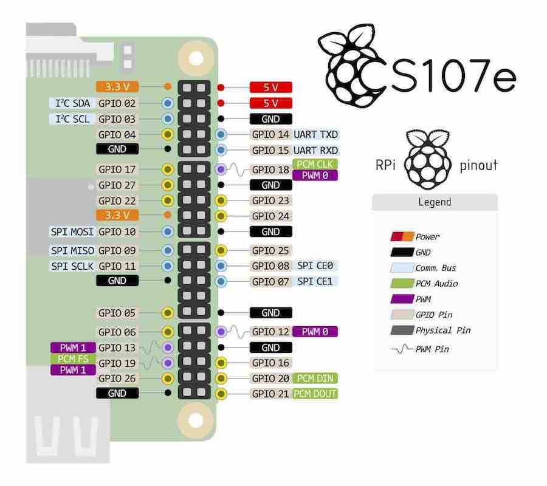
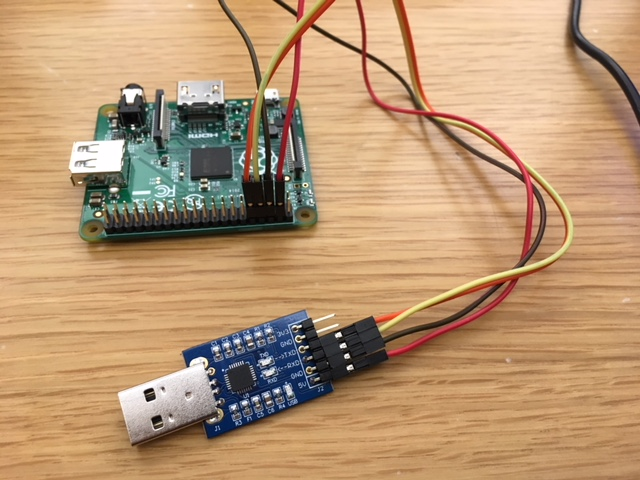

*Lab written by Pat Hanrahan*

## Goals

During this lab you will:

1.  Learn how to cross-develop on your computer for the Raspberry Pi's ARM processor.
2.  Learn how to use a breadboard with LEDs and buttons.
3.  Learn how to download and run bare metal programs on the Raspberry Pi.

## How does lab work?

Before beginning,
you should find a partner and introduce yourself to one another.
Together you can tackle the exercises outlined below.
Along the way,
you are encouraged to chat with your neighbors 
to share insights and offer each other useful tips.
The instructors and TAs will circulate the room
to offer advice and answers 
so as to keep everyone progressing smoothly.

Lab is a time to experiment and explore. It follows up on the topics from
recent readings/lectures with guided exercises ensuring you comprehend the
material, putting your knowledge into practice, trying out the tools in a
supported environment, and preparing you to succeed at the assignment to come.

Bare metal programming requires precision. It is easy to get stuck by the most
trivial error, which is often almost impossible to see yourself. Our goal in
the lab is to get you past these bumps in the road as fast as possible. We
don't want you to feel frustrated because something doesn't work.

To keep tabs on your lab progress, we provide a set of check-in questions that
you can use to self-test your understanding of the lab topics. Try to answer
those questions as you go and please talk with us to resolve any confusion or
issues that come up.  The check-in questions are deliberately simple.  We use
them merely to record your participation and get a read on how far you got.  To
get the most out of lab, you should not do the minimal required of you in the
shortest possible time.  Even if you think you understand the material, you
should use the lab time to dive into the nooks and crannies.  You should also
get to know the instructors.  They are masters of the craft, and you will learn
a lot by talking to them and asking them questions.  Any topic is fair game.

The combination of hands-on experimentation,
give and take with your peers,
and the expert guidance of the TA 
is what makes lab time truly special.
Your sincere participation can really accelerate your learning!

## Prelab preparation

To prepare for this lab, you should do the following.

- If you are using a Windows laptop, download and install a virtual machine
  running Linux. We have written [instructions] on how to install this
  software. The virtual machine will have the arm cross-development tools (all
  starting with the prefix `arm-none-eabi-`) installed. (You should
  have done this for assignment 0 anyway.)

- If you are using a Mac laptop, download and [install the arm
  cross-development tools, console drivers, and uploader
  script](/guides/mac_toolchain/) from the course github repository.
  You do not have to install a virtual machine running Linux on a Mac,
  since OS X is already based on UNIX.

- Make sure you have installed and learned how to use Git. (You should have
  completed this in [assignment 0].)

- Review the [Unix command line].

You should come to lab with working versions of the cross-development
tools (all beginning with `arm-none-eabi-`) and a running version of
git.

Before coming to lab, you should be able to open a Terminal, type
the following two lines, and check for responses similar to this example:

    $ arm-none-eabi-as --version
    GNU assembler (GNU Tools for ARM Embedded Processors) 2.24.0.20150604
    Copyright 2013 Free Software Foundation, Inc.
    This program is free software; you may redistribute it under the terms of
    the GNU General Public License version 3 or later.
    This program has absolutely no warranty.
    This assembler was configured for a target of `arm-none-eabi'.
    $ git --version
    git version 1.9.3

If this doesn't work, don't worry. We will help you get set up in lab.

Finally, ensure that you have completed the setup from Assignment 0. Type
the following commands and check for similar output (note that your `$PATH`
may contain many other entries):

    $ echo $PATH
    ...:/Users/student/cs107e_home/cs107e.github.io/cs107e/bin:...
    $ echo $CS107E
    /Users/student/cs107e_home/cs107e.github.io/cs107e

We will use the following hand tools during this lab:

![Tools]

We do not have enough tools for everyone, so you will have to share them.
If you own tools, bring them to lab.
We like people to use their own tools;
it is very empowering.
It also means you will be able to work outside of lab.
If you don't own these tools, don't worry.
If you want to buy tools and don't know what to buy,
talk to the instructors. They love tools!

During this first lab you will be using 
a wire stripper/cutter (yellow handled widget),
a needle-nose pliers (green-handled widget),
and a multimeter (the orange thing with a display).
Don't worry about wire and other supplies; we'll provide that.

## Lab exercises

### 1. Assemble blink

All CS107e labs and assignments are distributed and managed as git
repositories.  For assignments, your code will be in your own personal
repository so that you can push your final code for grading.  For labs, you
will not need to turn in your code, so you will be able to simply pull the
public lab repository.

To keep things organized, we suggest that you used the `cs107e_home` directory
that we created in assignment 0 to hold all the repositories for the class:

    $ cd cs107e_home

Next, pull the latest version of the courseware repo and clone the lab repo:

    $ cd cs107e.github.io
    $ git pull
    $ cd ..
    $ git clone https://github.com/cs107e/lab1

Pull up the [check-in questions](checkin) and have it open in a browser
so you can refer to it as you go.

Now `cd lab1/code/blink` and type the commands:

    $ arm-none-eabi-as blink.s -o blink.o
    $ arm-none-eabi-objcopy blink.o -O binary blink.bin

If this works, you are good to go.

### 2. Inventory your kit

You will receive the official CS107e Raspberry Pi kit when you get to the lab.
Review the [kit contents](/guides/bom/). Take a moment to identify and inventory all the parts. Make sure your kit is complete.

(Recall that a [resistor](https://learn.sparkfun.com/tutorials/resistors)'s band colors tell its resistance: in this case,
10K or 1K ohms. Check out this [chart and calculator](http://www.digikey.com/en/resources/conversion-calculators/conversion-calculator-resistor-color-code-4-band).)

### 3. Power your breadboard

The next step is to wire up your breadboard.
Below is an example of a breadboard with clean wiring;
notice how hard it is to find any bare wires! This breadboard's components
have their wires cut to just the right length.

<!-- TODO: Replace this with a picture of actual breadboard. Students -->
<!-- were stopping reading here and trying to wire this up. -->

<!-- TODO: Maybe add a schematic / wire schematic picture for students -->
<!-- who don't know how rows/columns/rails wire up on breadboard? -->

![Breadboard][1]

When you wire your breadboard, be sure to choose (or cut) wires of the
proper length and arrange them neatly. Use different colors of
wires to annotate what they are for. If they're neat, it's easier
to see if everything is set up correctly.
Take your time and check your work. A little bit of care here 
will save you a lot of time later, because, when your system
has a bug, the set of things that you have to check is much smaller.

![Wiring diagram][wiring]

To begin, make sure you understand how breadboards work.
What holes are connected to what holes?
How are the power and ground rails connected?

Note that LEDs are directional.
The longer lead is the anode and the shorter lead is the cathode.
The voltage from anode to the cathode should be positive.
If the polarity of voltages are switched, the LED will not light up.

A LED needs a 1K current limiting resistor
otherwise it will literally 
[blow up](https://www.youtube.com/watch?v=JCPXckfT-6g)
(you may even see smoke).
Current will flow through this resistor and then through the LED.
There are various ways to wire up the LED (see below);
we connected the cathode of the LED to the resistor 
and then connected the other end of the resistor to GND 
(the blue bus).
Note how the LED crosses over the middle of the breadboard.
To light up the LED, we need to apply 3.3V or 5V to the anode
and complete the circuit by connecting the cathode to GND.

To check that the LEDs are working, you need a power source.
We will draw power from your laptop
using the *USB to Serial Dongle*.
This is the small black breakout board with a USB connector
on one side and a 6-pin header on the other side.
The USB connector is inserted into a USB port on your laptop,
and the header has power and ground pins.

When wiring, electronics gurus use colored wires to indicate what type of
signal is being carried by that wire.
This makes debugging tangled wires much easier.
Generally, we will use the following conventions.

-   Black (GND)
-   Red (5V)
-   Orange (3.3V)
-   Blue (host output)
-   Green (host input)

For now, you will need just red and black jumpers.

To provide power to your breadboard,
do the following steps in **precisely this order**.

1. Find two female-male jumper cables, one red and one black.

2. Plug the female ends of the jumpers to the USB-serial breakout board.
Plug the red jumper to 5V and the black jumper to GND.

3. Plug the male end of the black jumper into the blue
ground rail of the breadboard. (Remember to include the 1k resistor between the LED cathode (shorter leg) and GND!)
Then plug the male end of the red jumper to the anode (the longer end) of the LED.

4. Plug the USB connector into your laptop.
A small led should light up on the breakout board
showing that it has power.
The LED connected to the red jumper should also now be lit.
One by one, check that each LED is wired properly.

When you have finished, this is what it should look like.

**Warning:
Don't have the USB serial breakout board plugged in 
while you are fiddling with the wiring.
The breakout board provides power which means all the wires are live.
This can cause a short circuit, which could fry your Pi.**

![LED]

While the LED is lit, make the following measurements with the multimeter.

-   Measure and record the voltage across the resistor.
-   Measure and record the voltage across the LED.

Calculate the current flowing through the LED. You should now be able to answer the first [check in question](checkin).

### 4. Power via the Pi

Now we will rewire things so that we power the Raspberry Pi,
and also have it provide power to the breadboard.

Start by looking at the 40-pin GPIO header on the side of the Raspberry Pi A+.
These pins match this detailed diagram of all the GPIO pins.
Note all the GNDs and power pins on your Pi (both 3.3V and 5V).

In order to connect the USB-serial breakout board to the Raspberry Pi,
we will need female-female jumpers.
Replace the red and black female-male jumpers 
with red and black female-female jumpers.
Wire 5V on the USB-serial breakout to 5V on the Pi,
and GND on the breakout board to GND on the Pi.
Now connect the female-male jumpers that were originally connected
to the breakout board to the GPIO headers on the Pi.
Inspect the diagram above and find a pin that provides 5V,
and another pin that is GND.
Power is now flowing through the USB-serial breakout board
to the Raspberry Pi and then to the breadboard.

After finishing wiring things up,
insert the USB serial breakout board in your laptop - 
the LED should light up.
You should also see the power LED on the Raspberry Pi lit up.

![Pi LED]

Replace your 1K resistor with a 10K resistor. Does the brightness of
the LED change? (You might want to coordinate with another group so
you can compare them side by side.) Why?

### 5. Use the SD card

Your Raspberry Pi kit contains an SDHC card.
A secure digital (SD) card contains non-volatile memory for storage.
The HC in SDHC stands for high capacity.

The Raspberry Pi runs the software on the SDHC card 
inserted in the SD card holder on the bottom of the Pi.

Most laptops contain a SD card slot.
To copy software to the SDHC card,
you need to mount it on your laptop.
To do this, insert the SDHC card into the SD card holder,
and then insert the holder into your laptop's SD card slot.

**Some laptops do not contain a SD card slot.
If your laptop does not contain an SD card slot,
we recommend you mount the SD card and copy files
using your partner's laptop.**

When you insert the SDHC card it should mount automatically.
You should see it show up in your file explorer.

Another way to cerify that the card is mounted is to list 
the mounted Volumes. If you're on a Mac:

    $ ls /Volumes
    Macintosh HD    NO NAME

By default, the SD card volume is named `NO NAME`.
You can change the name if you wish.

**If you're on Windows and using the VM, you may need to conscript a
labmate or get a USB SD card reader for the next couple parts of this
lab -- even if your laptop has an SD card slot, the VM may not support
using it inside Linux.**

**Don't worry, though: you shouldn't need to modify the SD card after
this lab, because you can just use the bootloader shown in Part 7.**

Now, we'll use the Raspberry Pi firmware that we provide in the [courseware GitHub
repository](https://github.com/cs107e_home/cs107e.github.io/tree/master/firmware).

Right now, you might be in the `blink` folder from step 1. If so, change
your shell's current directory to the firmware folder.

    $ pwd
    /Users/[USERNAME]/cs107e_home/lab1/code/blink
    $ cd /Users/[USERNAME]/cs107e_home/cs107e.github.io/firmware

(The part of that path before `cs107e_home` might be different depending on
where you created the directory in the beginning.)

There should be 4 files in that `firmware` folder.

    $ ls
    blink-actled.bin   bootloader.bin  
    bootcode.bin       start.elf

`bootcode.bin` is the code that boots the GPU,
and `start.elf` is the GPU start up code. 

For the Pi to work, you need to copy those files onto the SD card.
You also need an an additional file, named `kernel.img`. 
But notice that we don't give you a `kernel.img` here!
Normally, `kernel.img` is the operating system kernel you want to run
on the Pi, like Linux or Windows.

In this course, we will write our own programs to take its place,
and put one of them in under the name `kernel.img` instead.

Now notice that we've given you two additional programs,
`blink-actled.bin` and `bootloader.bin`.

We will run `blink-actled.bin` first, which blinks the activity (ACT)
LED on the Raspberry Pi itself (the 'Activity  LED).

Next, follow these steps in the following order:

1. Copy the files onto your SD card. (You can use either the Terminal
or the Finder for this.)    

2. Once on your SD card, rename the copy
of `blink-actled.bin` to `kernel.img`. After we put the card in, the Pi should now run our
blink-actled program!

3. Check that you have the required files on your SD card.

        $ ls
        bootcode.bin  kernel.img  start.elf

    `bootcode.bin` to boot the GPU

    `kernel.img` binary which the Pi runs once plugged in

    `start.elf` to start up the GPU

4. Now eject the SDHC card. If the Terminal prevents you from ejecting, type in `cd ..` to move to the parent folder.

5. Insert the SD card into the Raspberry Pi.

6. Power it up.  The on-board activity (ACT) LED, on the Raspberry Pi,
should start blinking.

Hoorah!🎉

**If you have trouble,
check out the troubleshooting part of the
[Working with SD cards] guide.
This part has been written assuming you have a Mac,
but there are also instructions in this guide for 
how to do this process using Linux.**

Keep this procedure in the back of your mind.
If you ever think your Pi is not working because of a hardware problem,
repeat these steps.
If the ACT LED doesn't blink after booting, 
then something is wrong and you may need to replace the Pi with a working one.

### 6. Blink breadboard LED

To do this, start by wiring the LED on your breadboard to GPIO 20 (pin 38).

![GPIO 20 connected to LED]

Mount the SD card again. Delete the `kernel.img` we put there before.

This time, copy your assembled `blink.bin` file 
(**the one you created way back in lab step 1**)
to your SD card and rename it `kernel.img`.

You've basically replaced the `kernel.img` you put in there before (which
was a copy of `blink-actled.bin`).

Eject the SD card and insert it into the Raspberry Pi.

It should now blink the LED on your breadboard.

Hoorah, hoorah!🔥

### 7. A better way: bootloader

Each time you change your code, you could repeat this process.
This would involve
powering down your Pi,
manually ejecting the SD card, 
inserting the SD card into your laptop,
copying the new version of your code to `kernel.img`,
unmounting and ejecting the SD card from your laptop,
inserting it into the Pi,
and then powering it up.
This quickly becomes tedious.
Even worse, the SD connectors are only designed to withstand
around 1000 insertions and deletions, after which they fail.

There is a better way: use a bootloader.
The bootloader avoids having 
to move your SD card back and forth 
between your laptop and the Raspberry Pi.
You will learn to love the bootloader!

1. To install the bootloader, mount the SD card and copy
   `bootloader.bin` to the SD as `kernel.img`, replacing the program
   you had there before.

2. Eject the SD card and insert it into the Raspberry Pi. Now, when
   the Raspberry Pi powers up, the bootloader is run.

Next, let's actually send the bootloader a program from your
laptop. It's waiting.

The bootloader listens on the TX and RX pins for commands 
to load a program into memory on the Pi. 
A program on your laptop sends the bytes 
contained in a binary (`.bin`) file to the bootloader 
and the bootloader copies them into the correct memory location.
After the program is loaded,
the bootloader jumps to the start address of the program,
and the program begins to run.
Much, much simpler.

In order to do this you need to establish a communication
channel between the Raspberry Pi and your laptop,
We will cover the details of serial communication 
later in the course. For now let's just get everything set up.

The USB-serial breakout board
that you are using to power your Pi also contains pins
to communicate with the Pi.

At the end of the breakout board is a 6 pin header.
Two other pins are used for transmitting (TX) and receiving (RX).
The Pi also has a TX and RX pin (physical pins 8 and 10) on the GPIO header.

Now connect the TX and RX pins on your Pi 
to the RX and TX pins on the USB breakout board.

**Note: By convention, one device's TX should connect to the other's RX, and vice versa.**

_Make sure you do **not** connect TX to TX and RX to RX!_

The proper connections are shown below.
Note that your USB breakout board may have pins in different positions.
Don't just follow the picture blindly!

In this configuration, the green wire connects
the RX header pin on the USB serial breakout board
to the TX Pin (physical pin 8) on the Pi's header.
The blue wire connects the TX header pin
to the RX Pin (physical pin 10.

We have created a Python program that sends binary files to the bootloader.

**Make sure you're prepared to run the bootloader now.**

**If you are on a Mac, make sure you installed the CP2102 and serial drivers as
described in the [Mac toolchain guide](/guides/mac_toolchain). On Windows or
Linux, you don't need to do anything special here.**

Let's try the bootloader. In some Terminal shell, change back to the
directory where you assembled `blink.bin` in step 1. That's
`lab1/code/blink/`.

Now to load and run `blink.bin`, simply type:

    $ rpi-install.py blink.bin
    Found serial port: /dev/cu.SLAB_USBtoUART
    Sending `blink.bin` (72 bytes): .
    Successfully sent!

After a few seconds, you should see the LED blinking.

If you change your program and wish to reload it onto the Pi, you must
power cycle the Pi. Why can't you just run `rpi-install.py` again
after the bootloader's already loaded a program?

One way to power cycle the Pi is to unplug the USB-serial breakout board
from the USB slot on your laptop,
and then plug it in again.
The Pi will reboot into the bootloader, ready to load the new version of the program.

Retype the above `rpi-install.py` command, 
and the new version will be downloaded and run.

Hoorah, hoorah, hoorah!!

### 8. Study the blink program

    .equ DELAY, 0x3F0000

    // configure GPIO 20 for output
    ldr r0, FSEL2
    mov r1, #1
    str r1, [r0]

    mov r1, #(1<<20)

    loop: 

    // set GPIO 20 high
    ldr r0, SET0
    str r1, [r0] 

    // delay
    mov r2, #DELAY
    wait1:
        subs r2, #1
        bne wait1

    // set GPIO 20 low
    ldr r0, CLR0
    str r1, [r0] 

    // delay
    mov r2, #DELAY
    wait2:
        subs r2, #1
        bne wait2

    b loop

    FSEL0: .word 0x20200000
    FSEL1: .word 0x20200004
    FSEL2: .word 0x20200008
    SET0:  .word 0x2020001C
    SET1:  .word 0x20200020
    CLR0:  .word 0x20200028
    CLR1:  .word 0x2020002C

If there is anything you don't understand about this program,
ask questions of your partner and others.

Do the following exercises:

-   Look at the bytes in the `blink.bin` you assembled earlier by
    running `xxd -g 1 blink.bin` at a shell in the `blink` folder.

    (`xxd` is a command that prints the bytes in a file in a
    human-readable form. You can run `man xxd` to learn more. What are
    the numbers at the beginning of each line `xxd` outputs?)

    Find the first occurrence of `e3`. What is the byte offset of `e3`
    relative to the start of the file?

-   Change the program such that the blink rate slows down by a factor
of 2.

    Note that changing the program is a multiple-step process. First
    you need to edit `blink.s` in a text editor, then go through the
    commands in step 1 again to make `blink.bin` from it, and then
    finally unplug and replug the Pi and run `rpi-install.py` again to
    actually run your new `blink.bin` on it. Make sure you understand why
    these steps are all necessary.
    
    Now perform experiments to determine how many instructions per second the
    Raspberry Pi executes.

### 9. Add a button! (optional)

This last part is optional.
You do not need to use a pushbutton for Assignment 1,
but you will need to use it for Assignment 2.
There are no check-in questions for this exercise.

Now let's turn to the pushbuttons.
Measure the resistance across the pushbutton legs using a 
multimeter and figure out which pins are always connected 
and which become connected when the button is pushed.
Use your measurements to position the button correctly on the breadboard. 
The pushbutton needs a 10K pull-up resistor to the red power rail.
Verify that the resistor is 10K Ohms using the multimeter.
Measure the voltage at the pin, and measure it again when you push the button.

Here is a program that reads a button and turns on or off the LED depending on
whether the button is pressed.

    // configure GPIO 10 for input
    ldr r0, FSEL1
    mov r1, #0
    str r1, [r0]

    // configure GPIO 20 for output
    ldr r0, FSEL2
    mov r1, #1
    str r1, [r0]

    // bit 10
    mov r2, #(1<<10)

    // bit 20
    mov r3, #(1<<20)

    loop: 
        // read GPIO 10 
        ldr r0, LEV0
        ldr r1, [r0] 
        tst r1, r2
        beq on // when the button is pressed (goes LOW), turn on LED
        
        // set GPIO 20 low
        off:
            ldr r0, CLR0
            str r3, [r0]
            b loop

        // set GPIO 20 high
        on:
            ldr r0, SET0
            str r3, [r0]
            b loop

    FSEL0: .word 0x20200000
    FSEL1: .word 0x20200004
    FSEL2: .word 0x20200008
    SET0:  .word 0x2020001C
    SET1:  .word 0x20200020
    CLR0:  .word 0x20200028
    CLR1:  .word 0x2020002C
    LEV0:  .word 0x20200034
    LEV1:  .word 0x20200038

To run this program, connect the button to GPIO 10 (pin 19).
Make sure the jumper is
connected to the right pin on the Raspberry Pi.
Also, make sure the pull-up resistor is properly installed on the breadboard.

Challenge yourself to understand
what each line of code accomplishes and why it works as expected.
Feel free to add your own code annotations if that helps.

Here are a few questions to test your knowledge.  To answer these questions you
will have to read the [Broadcom peripheral
manual](https://www.raspberrypi.org/documentation/hardware/raspberrypi/bcm2835/BCM2835-ARM-Peripherals.pdf),
or ask someone who knows the answer.

-   What does the peripheral register with the address 0x20200034 return?

-   Why does the input value go to 0 (LOW) when the button is pressed?

-   How does the Pi know which branch to jump to when it reaches `beq on`?

## Check in with TA

At the end of the lab period, go over your [check-in questions](checkin) with a TA. The TA will
verify your progress and ensure you and your partner are properly credited for your
work.

Note, again, that the goal of the lab is not just to finish the
check-in -- it's to understand the material. The check-in questions are a very
rudimentary test of that.

It's okay if you don't completely finish all of the exercises during
lab; your sincere participation for the full lab period is sufficient
for credit.  However, if you don't finish, we highly encourage you to
work those parts to solidify your knowledge of this material before
moving on! In particular, the first assignment assumes you have
successfully completed this lab.

  [instructions]: /guides/vmware/
  [Unix command line]: /guides/unix/
  [assignment 0]: /assignments/assign0/
  [Tools]: images/tools.jpg
  [Kit]: images/kit.jpg
  [guide]: http://ch00ftech.com/2012/07/28/the-ch00ftech-guide-to-breadboarding/
  [video]: https://www.youtube.com/watch?v=Yzfk0t0HfZc#t=225
  [Breadboard]: images/ch00ftech.jpg
  [1]: images/breadboard.jpg
  [wiring]: images/protowire2.jpg
  [LED]: images/updated-photo1.jpg
  [GPIO]: images/pi_pinout.jpg
  [Pi LED]: images/piled.jpg
  [working with sd cards]: http://cs107e.github.io/guides/sd/
  [GPIO 20 connected to LED]: images/updated-photo-2.jpg
  [bootloader guide]: /guides/bootloader
