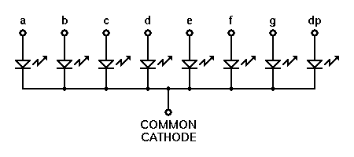
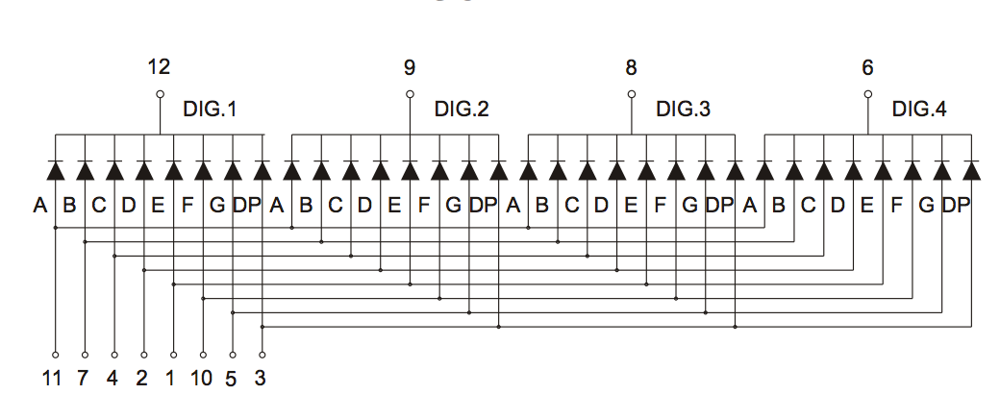

*Lab written by Pat Hanrahan*


From Death Valley, CA.

## Goals

During this lab you will:

1. Understand the assembly language produced by `gcc` when compiling a C program.

2. Understand basic `Makefile`s.

3. Learn how to unit test your C program.

3. Setup up a 4-digit 7-segment display 
   for your next assignment - building a clock.

## Prelab preparation

To prepare for this lab, you should do the following.

1. Read our [gcc guide](/guides/gcc)
   about how to compile C programs for bare metal
   programming on the Raspberry Pi.

2. Read our [make guide](/guides/make)
   on setting up makefiles for cross-development
   on the Pi.

3. Read [section 1.1 of this lab](#crossref) on the theory of operation
   for 7-segment displays. It may also help to skim the rest of section 1

4. Clone the lab repository found at `https://github.com/cs107e/lab2`

You will be doing a lot of breadboarding in the this lab. If you have your own tools (strippers, pliers, etc.), please bring them! We will have tools to share, but it can be extra-empowering to work with your own tools.

## Lab exercises

Pull up the lab [check-in](checkin) for the questions for which we want you to jot down answers and discuss with the TA when checking out at the end of lab. We don't grade you on correctness or collect your answers; we check in with each of you to make sure you've completed the lab and understand the concepts.

<a name="crossref"></a>
### 1. Wire up display breadboard (0:00 - 1:10)

Your first assignment will be to build a simple clock
using a 4-digit 7-segment display. This lab will get you
set up to do this.

This lab exercise has been deliberately designed to step you 
through the process and has you test each stage as you go. 
A "test as you go" strategy is the hallmark of a great engineer, please follow along carefully!

#### 1.1) How the display works (0:00 - 0:10)

Let's start by understanding how a single 7-segment display works.

 

The 7-segment display, as its name implies,
is comprised of 7 individually lightable LEDs,
labeled A, B, C, D, E, F, and G.
There is also a decimal point labeled DP.
Each segment is an LED. 
Recall that an LED has an anode and a cathode.
The polarity matters for an LED;
the anode voltage must be positive relative to the
cathode for the LED to be lit.
If the cathode is positive with respect to the anode,
the segment is not lit.

On the 7-segment displays we are using,
the cathodes (ground) are all connected together,
to a single ground. 
Such a display is called a *common cathode* display.



To display a digit, you turn on the appropriate segments by connecting the
common cathode (ground) to ground and applying a voltage to those segment
pins. Turning on all the segments would display the digit `8`. Here is a
[nice online simulation of a 7-segment display](http://www.uize.com/examples/seven-segment-display.html).

You should now be able to answer the [third check-in question](checkin).

Your clock will display minutes and seconds.
We will need 2 digits for the minutes and 2 digits for the seconds,
for a total of 4 digits.
We will be using a display with four 7-segment displays integrated into a single unit, as shown in the photo below:

[](images/display.jpg)

And here is its schematic:

[](images/display.schematic.png)

Study these diagrams.
There are 12 pins in total: 4 digit pins and 8 segment pins.
The 4 digit pins (the cathodes/grounds for each digit) are
labeled DIG.1, DIG.2, DIG.3, and DIG.4. The 8 segment pins are labeled A, B, C, D, E, F, G, DP.
Notice how the pins are internally wired to the LEDs.
Each digit is an individual common cathode 7-segment display.
The segments (A-G) are wired to all 4 digits.
Each digit has its own ground pin.
So, if you turn on segment
pins B and C, and connect DIG.1 and DIG.2 to ground, the first
and second digits will both display "1"  while the third and 
fourth digits will not display anything (their ground is not
connected).

Here is a handy photo of the display with the pins labeled. Note that DIG.1,
DIG.2, DIG.3, and DIG.4 have been renamed to D1, D2, D3, and D4.
<a name="pinout"></a>


The pins also have numbers.
The pin on the bottom-left is numbered 1,
and the numbers increase as you move right up to 6,
and then continue around on the top.
Note that pin 12 is in the top-left corner.

#### 1.2) Wire up resistors/segments (0:10 - 0:25)

In this step, you are going to wire up the segments of the display and turn
them on. For ease of debugging, we recommend that you first wire up the display
using jumper cables. After validating your circuit, then you can re-wire it in
a more neat and permanent fashion.

First, connect the two power rails and two ground rails on your breadboard.
This makes accessing power and ground via jumpers more convenient. My
convention is to always orient my breadboard so that the blue ground rail is on
the bottom (after all, ground is always underneath us).


Second, insert the display onto the breadboard. Make sure the display is
oriented correctly (the decimal points should be on the bottom, and the digits
slanted to the right). We recommend placing the display to one side of the
board to allow plenty of space for wiring.

Take advantage of the column numbering on your breadboard to align your
display. This makes it easier to know which numbered hold is connected to a
specific pin, since after you insert the display into the breadboard you can't
see the pins. We chose to place our display so __pin 1 of the display is aligned with column 50 on the breadboard__.

Third, place a single 1K resistor on the board bridging two rows over the
middle and clip the leads so that it sits neatly.

Hook up the power and ground rails of the breadboard to the 3.3V and Ground
pins on your Raspberry Pi. Find three short male-male jumpers. Wire the top of
the resistor to the red power rail using an orange jumper (since orange
indicates 3.3V) and wire a green jumper from the bottom of the resistor to
segment A (Pin 11, which will be at breadboard column 51 if you aligned Pin 1
to column 50 as described above). Wire digit D1 (Pin 12, column 50) to Ground
using a black jumper. When you apply power to your Rasberry Pi, segment A of
digit 1 should light up as shown below:


You can light up other segments on the display by moving your jumpers around.
Use the [labeled photo above](#pinout) to review the display pinout. Rewire
your segment jumper to light up segment B instead of segment A. Rewire your
digit jumper to light up segment B of digit 2 instead of digit 1. Add an
additional digit jumper to light up segment B of **both** digits 1 and 2.  Note
that you cannot simultaneously display different segments on different digits:
Why not?

For the remainder of the lab, the breadboard samples will be accompanied by
_circuit schematics_. Here's the diagram we used to generate the breadboard
shown above. 


**Check in:** Can you identify all of the components in the above schematic?

Now place eight 1K resistors on your breadboard, one for each segment. We
suggest using the convention that the first resistor controls segment A and so
on such that the last resistor controls segment DP. After you insert the
resistors, test your circuit. Simultaneously wiring up all segments with 8
jumper cables can be messy; instead use a pair of jumpers to wire up 2 segments
at a time and move the jumpers to test all 8. As you go, you may want to make a
sketch of the correct connection between each resistor and its display pin you
can refer to when wiring up the permanent circuit.

**Check in:** Wire up your jumpers to display the pattern `"1 1 "`, just as in
the schematic below. Here a space means that the digit is blank (no segments
turned on). 


#### 1.3) Wire up transistors/digits (0:25 - 0:35)

Up to now, you have been controlling whether a digit is on by adding or
removing a jumper that connects the digit pin to ground. We eventually want to
control which segments and digits are turned on using the Raspberry Pi GPIO
pins, so we need an electronic switch that can be controlled using these pins.
To do this we will use bipolar-junction transistors, or BJTs. 

A transistor has 3 terminals— the base (B), collector (C), and emitter (E).
The base controls the amount of current flowing from the collector to the
emitter. Normally, no current flows from collector to emitter. This condition
is an open circuit. However, if you apply 3.3V to the base, the collector will
be connected to the emitter and current will flow. This is equivalent to
closing the switch.

We will be using 2N3904 transistors. The following diagram identifies which
pins on the 2N3904 are collector, base, and emitter.


Note the transistors have a flat side and a rounded side. If you are looking
at the flat side with the legs pointing down, the leftmost leg will be the
emitter.

Instead of wiring a digit pin directly to ground as before, the digit pin
connects to the collector of a transistor whose emitter is connected to ground.
Applying power to the transistor base activates the switch and grounds the
digit pin.

First, disconnect all direct connections from your digit pins from ground.
Place the 4 transistors in your breadboard. Once again, we suggest lining your
transistors such that the leftmost transistor will control digit pin D1 and the
rightmost, pin D4.

Now let's connect up D1's transistor. Wire the collector to D1 and the emitter
to ground. Connect the base to the control voltage through a 1K
current-limiting resistor.

Apply power to the base of the transistor.
You should see `"1 ‍ ‍ ‍ "` on the display.

Here's a board and matching schematic where we've connected _both_ D1 and D3 to
the collectors of transistors and applied power to the bases of those two
transistors, which displays `"1 1 "`.


**Check in:** test your transistor controlled display by turning on each digit
individually with a pattern such as `1`.

#### 1.4) Permanently wire circuit (0:35 - 1:10)

Now comes the time-consuming part. Each segment pin needs to be connected to
its resistor and each digit pin connected to the collector of its transistor.
Be patient, this takes some time. However, if it's taking you more than half
an hour or so in lab, try moving on and coming back to this part.

Here's a photo of what it should look like before wiring...


...and here is a full schematic of what you will be wiring up:


In the diagram above, the 3.3V input we've been using up to this point has been
replaced by labeled dots where you should connect jumpers from the GPIO pins on
the Pi. For example, setting Pins 10 and 20 to high will turn on the top
segment of the first digit.

#### 1.5) Connect to Raspberry Pi

The final(!) step is to connect the display to the GPIOs of your Raspberry Pi
so you can control the display with a program. We will outline the process in
the next few paragraphs. However, there is no need to do this in lab. You
should be able to do this on your own outside of lab.

We will use GPIOs 10-13 to control the 4 digits. GPIO 10 will control the
first digit, GPIO 11 will control the second digit, and so on. We will
dedicate GPIOs 20-27 to control the 8 segments (A-G and DP). GPIO 20 will
control segment A, GPIO 21 will control segment B, etc. In total, we will use
12 GPIOs on the Pi: 8 to control which segments are turned on, and 4 to control
which digits are turned on.

Setting the segment GPIOs (20-27) high and low determines which segments will
light up.  Similarly, setting the digit GPIOs (10-13) turns the transistors on
and off to control which digits light up.  When you implement your clock, you
will write a program that will first display digit 0, then it will turn off
digit 0 and turn on digit 1, and so on. Add some logic to keep track of time,
and you have a clock!

The extension for this assignment challenges you to provide a UI to the clock
that lets you set the time. You are constrained to use only 2 buttons. Here
is how we wired up 2 buttons on our breadboard.


### 2. C to assembly (1:10 - 1:30)

The goal of this exercise is to understand how C is translated 
into assembly language. You won't likely hand-code that much assembly, but you will often spend time __reading__ assembly, so the focus is on gaining reading familiarity.

We want you to have an understanding of 
how the compiler generates assembly from C
and be able to inspect that assembly to better understand 
the execution of a program.
As we will see, sometimes the assembly
produced by the C compiler can be surprising. 
Using your ARM superpowers, you can dig into the generated 
assembly and figure out what the compiler did, instead of sitting 
there dumbfounded when an executing program does not behave as expected!

Go to the `lab2/code/codegen` directory. Open the `codegen.c` source file in
your text editor. The file contains four parts that explore different aspects of C: arithmetic, if/else, loops, and pointers.

Skim the C code and read the comments we provide. To see how that C is translated by the compiler, you can run `make` and  open the `codegen.list` file, but it's a bit faster (and definitely more fun!) to
play with the online Compiler Explorer we used in lecture.

Bring up the [Compiler Explorer](https://godbolt.org/#g:!((g:!((g:!((h:codeEditor,i:(j:1,lang:c%2B%2B,source:'//+Type+your+code+here,+or+load+an+example.%0Aint+square(int+num)+%7B%0A++++return+num+*+num%3B%0A%7D'),l:'5',n:'0',o:'C%2B%2B+source+%231',t:'0')),k:50,l:'4',n:'0',o:'',s:0,t:'0'),(g:!((h:compiler,i:(compiler:arm541,filters:(b:'0',binary:'1',commentOnly:'0',demangle:'0',directives:'0',execute:'1',intel:'0',trim:'0'),lang:c%2B%2B,libs:!(),options:'-Og+-ffreestanding+-marm',source:1),l:'5',n:'0',o:'ARM+gcc+5.4.1+(none)+(Editor+%231,+Compiler+%231)+C%2B%2B',t:'0')),k:50,l:'4',n:'0',o:'',s:0,t:'0')),l:'2',n:'0',o:'',t:'0')),version:4) in a browser window. Choose the compiler `ARM gcc 5.4.1 (none)` and enter flags `-Og -ffreestanding -marm`.  This gives you a close approximation of our compiler version/environment (although not an exact match). Paste each part
from `codegen.c` into the Compiler Explorer window and read through the generated assembly to understand the compiler's translation. Use the comments in the C source code as your guide for what to watch for. 

Keep in mind that a great way to learn how a system works is by trying
things. Curious about some C code is translated to assembly? Try it out and see. Let your curiosity be your guide!

### 3. Makefiles (1:30 - 1:45)

Break into pairs and read the following Makefile.

```
    NAME = blink

    CFLAGS = -g -Wall -Og -std=c99 -ffreestanding
    LDFLAGS = -nostdlib -e main

    all: $(NAME).bin
     
    %.bin: %.elf
        arm-none-eabi-objcopy $< -O binary $@

    %.elf: %.o
        arm-none-eabi-gcc $(LDFLAGS) $< -o $@

    %.o: %.c
        arm-none-eabi-gcc $(CFLAGS) -c $< -o $@
    
    %.list: %.o
        arm-none-eabi-objdump -d $< > $@

    install: $(NAME).bin
        rpi-install.py $<

    clean:
        rm -f *.o *.elf *.bin *.list
```

Discuss and document all the various features and syntactical
constructs used in this Makefile.

 - What do each of the CFLAGS do?
 - What happens if you just type `make`? Which commands will execute?
 - If you modify blink.c and run `make` again, which commands will rerun?
What part of each target indicates the prerequisites? (A prerequisite means 
that if that file changes, then the target is stale and must be rebuilt)
 - What do the symbols `$<` and `$@` mean?

You should be able to answer the [first check-in question](checkin) now.

### 4. Testing (1:45 - 2:00)

As you write more complicated programs, you'll want to test
them; keeping track of what parts of the program work and what parts don't is essential
to debugging effectively. Starting with assignment 2, we'll provide you with some 
automated tests and tools you can use to write your own tests.
Let's walk through a simple example with tests.

#### A buggy program

Go to the `lab2/code/testing` directory in your terminal.

Look at the simple program in `testing.c` that defines a (buggy) `is_odd` function. The `main()` function is tries `is_odd` on a variety of inputs and uses `assert()` to validate that the result was correct.  If result was correct, the assert succeeds and the program continues on normally. If the result was incorrect, the assert fails and raises an error. 

We can use `assert()` to test that our program is working as expected.
If we pass in an expression that we're *expecting* to be true and `assert()` throws an error, we know that we have a bug
in our program. If our program is working correctly, our assert statements should return smoothly.

Take a moment to answer the [second check-in question](checkin).

#### Build the program

Now run `make`.

Running `make` will generate both `testing.bin` and
 `testing.list`. To produce `testing.bin`, the computer needs to
_compile_ `testing.c` to `testing.o`, then _link_ that `.o` with some
other object files to form `testing.elf`, then strip that down to
`testing.bin`. We will learn more about linking later.

This Makefile is also configured to build a `testing.list` file that contains the text of the ARM assembly instructions compiled from the `testing.c` C source file.

Whenever you make a change to your program, run `make` again to rebuild the program from the changed files and generate a new assembly list file.

#### What do you expect?

Before we run the program, let's think about what we expect to
happen. The `assert` macro (in `assert.h`) will call `abort` if its 
argument evaluates to false, but what does `abort` do? (hint: look in `abort.c`)

Next, look at `cstart.c` and determine what will happen if your
program returns from `main()` without an assertion failure (i.e., what
will happen if the program works!). Don't worry about the `bss` stuff
for now: we will talk about that in class soon.

__If `is_odd()` has a bug, what would you expect to see on the Pi? In
contrast, what would you expect to see on the Pi if `is_odd()` worked
properly?__


#### Run the program

Run `rpi-install.py testing.bin`. You should get the blinking red
LED of doom. You now know at least one test failed, but which one?
The strategy from here is to iterate, selectively commenting in/out 
test cases and re-running to narrow in on which specific cases fail. 
How many of the test cases pass? How many fail?  Which ones? Why?

Use the information you glean from the test cases to identify what is wrong.
Now fix the bug in `is_odd` so that it works correctly for any argument.
Uncomment all test cases, rebuild, re-run, and bask in the glow of the green light of happiness!

#### Make install

Phew, typing out `rpi-install.py testing.bin` so many times was
incredibly taxing on your poor fingers! Try adding a recipe for
`install` to your Makefile that allows you to build and a run
a test program on your Pi with the single command `make install`.

## Check in with TA

Make sure you [check in](checkin) with a TA before you leave.

## For later

After this lab, on your own time, you may try the following:

1. Finish any parts of `codegen.c` you didn't complete during lab.
2. Go through the Makefile in the `testing/` subdirectory of `code/`.
3. Finish wiring up your beautiful clock breadboard.
