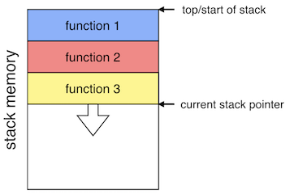
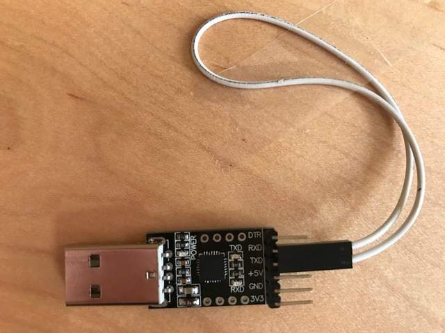

*Pat Hanrahan*

## Goals

During this lab you will:

1. Learn how to debug using `arm-none-eabi-gdb` in simulation mode. 
Simulation mode is also a good way to learn more about how the ARM processor executes instructions.
2. Understand function calls and stack frames.
3. Learn how to use `screen` with the USB-serial breakout board.Also understand how the UART peripheral works on the Raspberry Pi.
4. Implement a few simple C-string operations and use a combination of
unit testing and gdb simulation to debug your work.

## Prelab preparation
To prepare for lab, do the following: 

1. Read our [gdb guide](/guides/gdb) about running gdb in simulation mode.
2. Read the background section below on "Stack Intuition".
3. Pull the latest version of the `cs107e.github.io` repository.
4. Clone the lab repository which can be found at
   `https://github.com/cs107e/lab3`.
5. Note that this is the first time we will be using the `CS107E` environment
   variable that was set up during assignment 0. During the lab, if you see the
   following error message:

   ```
   Makefile:43: *** ERROR - CS107E environment variable is not set.
   
   Please set it to point to the `cs107e.github.io/cs107e` directory using the
   command `export CS107E=/path/to/your/copy/of/cs107e.github.io/cs107e`.
   
   To have this done automatically, add the above command to your shell
   environment configuration file (e.g. ~/.bashrc) .  Stop.
   ```
   Find a staff member to get help. This issue must be resolved before you will
   be able to work on the next assignment.

## Background: stack intuition

Functions often need space. For example, they allocate 
variables or store the return
address of their caller before calling another function. There's
nothing special about this space, and we could allocate it as we would
any other memory.  However, functions calls are frequent, so we want
them as fast as possible.  Fortunately, function calls have two important
properties we can exploit for speed:

1. When functions return, all allocated memory is no longer usable.
2. Functions return in Last-In-First-Out (LIFO) order.

To optimize for speed, people have converged on using a contiguous region of memory
(called a *stack* because it's LIFO, like a stack of plates).  Roughly speaking it
works as follows:

+ At program start we allocate a fixed-sized region to hold the stack and set a
pointer (the stack pointer) to the start of that region.
+ The memory the function needs is allocated contiguously by simply adjusting
the stack pointer.
+ When a function returns, it frees the allocated memory
all-at-once by returning the stack pointer to its position when the function
was called.

Note that the stack on our system operates as a _descending_
stack. This means the stack pointer is initialized to at the highest
address.  Code decrements the stack pointer to make space for
a function call and increments the stack pointer when that function
call returns. It looks like this:



This organization is so effective that compilers explicitly
support it (and do the stack pointer increment and decrement) and
architecture manuals provide the rules for how to do so.
If you know `malloc()` and `free()`, one way to compare this method
and those functions is that the fastest `malloc()` is incrementing a pointer
and the fastest `free()` is decrementing a pointer.

## Lab Exercises
Pull up the [check in questions](checkin) so you can refer to them as you go.

### 1. Debugging with gdb

Once 45 minutes of the lab has elapsed, please explore sections 2 and
on! We have included lots of adventures in GDB so you can continue
exploring after lab.

#### 1a) Using `gdb` in simulation mode

The goal of the first exercise 
is to practice using `gdb` in ARM simulation mode.
This is useful as a way of learning what happens
when ARM instructions are executed, and to debug programs.

We will start by running `gdb` with the example `simple` program. This is
similar to code showed in the lecture on functions.
Begin by changing to the `lab3/code/simple` directory and building the program
using `make`.

Now run `arm-none-eabi-gdb simple.elf`.  Note that is the ELF 
version `simple.elf` that we use in conjunction with the gdb simulator, 
not the raw `simple.bin` that we have been running on the actual Pi.
Ignore the warning related to the Python gdb module.

```
$ arm-none-eabi-gdb simple.elf
GNU gdb (GDB) 7.8.1
Python Exception <type 'exceptions.ImportError'> No module named gdb:

warning:
Could not load the Python gdb module from `/Users/ibush/bin/arm-none-eabi/share/gdb/python'.
Limited Python support is available from the _gdb module.
Suggest passing --data-directory=/path/to/gdb/data-directory.
...
(gdb) 
```

Start by putting `gdb` in simulation mode,
and then load the program.

```
(gdb) target sim
Connected to the simulator.
(gdb) load
Loading section .text, size 0x168 vma 0x8000
Start address 0x8000
Transfer rate: 2880 bits in <1 sec.
```

`gdb` allows us to control program execution.
Let's single step through the program. Follow along
with the sequence of commands below.

```
(gdb) break main
Breakpoint 1 at 0x8128: file simple.c, line 31.
(gdb) run
Starting program: .../lab3/code/simple/simple.elf 
Breakpoint 1, main () at simple.c:31
```
Note the last line in the snippet above. 
`gdb` has run the program up to line 31 and stopped,
because you set a *breakpoint* at the start of `main`.

```
Breakpoint 1, main () at simple.c:31
31  {
(gdb) next
34      int d = diff(x, y);
(gdb) next
35      int f = factorial(7);
(gdb) print d
$1 = 74
```

Typing the `next` command executes
the next line in the program.
This line calls the function `diff`.
The command `print d` shows the value of `d`
after the call completes. 

When `gdb` shows your program stopped at a line, 
it's stopped  _before_ that line has executed. After
the above snippet, the program is stopped before calling 
`factorial`. If you attempt to print `f`
before executing its declaration statement, the debugger
will report that the variable is not (yet) accessible.

Sometimes you want to step into the function being called.
To do this, use `step` instead of `next`. Put another
way, `next` executes until the next line in the function
you're in, while `step` executes the next line of code, 
which may be in a different function.

Use `run` to restart the program
and then use `step` to when you hit the breakpoint.

```
(gdb) run
The program being debugged has been started already.
Start it from the beginning? (y or n) y

Breakpoint 1, main () at simple.c:31
16	{
(gdb) step
34      int d = diff(x, y);
(gdb) step
diff (a=a@entry=33, b=b@entry=107) at simple.c:27
27      return abs(a - b);
```

You are now stopped at the first line of `diff`.  
If you `step` from here, you will enter in the call to the `abs` function.

```
(gdb) step
abs (v=v@entry=-74) at simple.c:5
5   }
```

When debugging a function, a common workflow is to

  1. `break` on the function.
  1. Use `next` to step through each line of its code, inspecting variables to see where
     the problem occurs.
  1. If the buggy line of code was a function call, to see what went wrong you'll need to run it
     again, so call `run` again: this will break on the function as in step 1. 
  1. Use `next` to reach the buggy function call, use `step` to drop down into it.
  1. Recursively apply rules 2-4 until you find the bug.

#### 1b) Using `gdb` to observe the stack

gdb also allows you to drop down to the assembly instructions and keep an eye
on the current values in the registers. Note that although `diff` is a function, not a variable,
gdb allows us to inspect using `diff`.

```
(gdb) print diff
$1 =  {int (int, int)} 0x8108 <diff>
```

The value of `diff` is the address of the beginning of the function, which in
this case is `0x8108` (your own address of `diff` may differ slightly).  Use
`delete` to delete any existing breakpoints and set a breakpoint at the `diff`
function:

    (gdb) delete
    Delete all breakpoints? (y or n) y
    (gdb) break diff
    Breakpoint 2 at 0x8108: file simple.c, line 26.
    (gdb) run
    Breakpoint 2, diff (a=a@entry=33, b=b@entry=107) at simple.c:26

A breakpoint at address A tells gdb to stop the program just before executing the
instruction at A.

You can print out the ARM instructions by disassembling the function `diff` using the command `disas diff`.
    
```
(gdb) disass diff
Dump of assembler code for function diff:
=> 0x00008108 <+0>:     mov r12, sp
   0x0000810c <+4>:     push    {r11, r12, lr, pc}
   0x00008110 <+8>:     sub r11, r12, #4
   0x00008114 <+12>:    rsb r0, r1, r0
   0x00008118 <+16>:    bl  0x8054 <abs>
   0x0000811c <+20>:    sub sp, r11, #12
   0x00008120 <+24>:    ldm sp, {r11, sp, lr}
   0x00008124 <+28>:    bx  lr
End of assembler dump.
```
Note that the first instruction of `diff` is at the
address `0x8108`, as we expect.

Use the command `info reg` to display all of the current registers.
```
(gdb) info reg
r0             0x21 33
r1             0x6b 107
r2             0x8168 33128
r3             0x8168 33128
r4             0x0  0
r5             0x4a 74
r6             0x0  0
r7             0x0  0
r8             0x0  0
r9             0x0  0
r10            0x0  0
r11            0x7ffffec  134217708
r12            0x7fffff0  134217712
sp             0x7ffffd8  0x7ffffd8
lr             0x8140 33088
pc             0x8108 0x8108 <diff>
cpsr           0x60000013 1610612755
```
What value is in `r0`? Why does `r0` contain that value?

You can access a single
register by using the syntax $regname, e.g. `$r0`.

```
(gdb) print $sp
$9 = (void *) 0x7ffffd8
(gdb) stepi
(gdb) stepi
(gdb) print $sp
$10 = (void *) 0x7ffffc8
```

The `stepi` command executes one assembly language instruction.
Note that the value of `sp` has decreased by 16
after executing the first few instructions in `diff`.

In this case, you're seeing that at the very start of `diff`, `$sp =
0x7ffffd8`, and then it's decreased by 16 after the `push`
instruction that writes the four registers that form the APCS frame. 
(Recall that the stack grows downward; the stack pointer
decreases as more values are pushed.)

`gdb` has a very useful feature that you can always
print out (display) values every time you step.
This is done with the `display` command.

Display what's at the location in memory pointed to by `sp`:

    (gdb) display /4xw $sp
    1: x/4xw $sp
    0x7ffffc8:      0x07ffffec      0x07ffffd8      0x00008140      0x00008114

This has the effect of displaying 4 words (w) going upward in memory,
beginning at the address `0x7ffffc8`. What is printed is the 4 values 
stored lastmost on the stack.  Those four values were placed there by a
`push` instruction. Examine the disassembly and figure out which four registers
were pushed.

Because you used the `display` command, gdb will reevaluate and print that
same expression after each gdb command. In this way, you can monitor what's on
top of our stack as you step through our program. This is amazingly useful and
much faster than typing `print` after each `next`, `step` or `stepi.`

Here is [a diagram of the state of memory](images/stack_abs.html)
right before the source line `return ` is executed in the `abs`
function. The diagram shows the complete address space of the `simple`
program, including the memory where the instructions are stored, as
well as the contents of the stack.  If you're feeling confused about
how the stack operates and what's going on in the program address
space, this figure can be very helpful. It has a lot of details, so
finding the exact thing you're looking for can be tricky, but with
a bit of care and time you'll be able to.

Now use `stepi` to move forward from here and watch what happens to the
stack contents:

    (gdb) stepi
    (gdb) [RETURN]
    (gdb) [RETURN]
    (gdb) [RETURN]

Hitting just [RETURN], causes `gdb` to repeat the last command (in this
case `stepi`).

Watch how the stack changes as you step through the function.
On which instructions does the value of the stack pointer change?

Use `delete` to delete any existing breakpoints. Set a breakpoint on
the `abs` function and re-run the program until you hit this
breakpoint.  Use the gdb `backtrace` to show the sequence of function
calls leading to where we are:

```
(gdb) backtrace
#0  abs (v=v@entry=-74) at simple.c:2
#1  0x0000811c in diff (a=a@entry=33, b=b@entry=107) at simple.c:27
#2  0x00008140 in main () at simple.c:34
```

The backtrace shows that the function `abs` has been called by `diff`
from line 27, which in turn was called by `main` from line 34.  The
numbers on the left refer to the *frame*.  The current frame is
numbered 0, and corresponds to the invocation of function
`abs`. Frames for caller functions have higher numbers.

    (gdb) info frame
    Stack level 0, frame at 0x7ffffc8:
    pc = 0x8054 in abs (simple.c:2); saved pc = 0x811c
    called by frame at 0x7ffffd8
    source language c.
    Arglist at 0x7ffffc8, args: v=v@entry=-74
    Locals at 0x7ffffc8, Previous frame's sp is 0x7ffffc8
    (gdb) info args
    v = -74
    (gdb) info locals
    result = <optimized out>


`info locals` reports that `result` is optimized out! This means that
the compiler decided that it did not need to use the stack to store its value.  Where,
is the value of `result` being tracked? Hint: look at the generated
assembly instructions to figure it out. Knowing assembly is useful. 

`gdb` also lets you inspect the whole state of the call stack.

    (gdb) up
    #1  0x0000811c in diff (a=a@entry=33, b=b@entry=107) at simple.c:28

This moves "up" the call stack, to the calling function. In this
case, it's function call #1, the function `diff` which called `abs`.

    (gdb) info args
    a = 33
    b = 107
    (gdb) info locals
    No locals.

Now let's go back "down" the stack frame for `abs`.

    (gdb) down
    #0  abs (v=v@entry=-74) at simple.c:3

Disassemble the code for `abs` and trace its operation instruction
by instruction.

```
(gdb) disass abs
Dump of assembler code for function abs:
=> 0x00008054 <+0>:     mov r12, sp
   0x00008058 <+4>:     push    {r11, r12, lr, pc}
   0x0000805c <+8>:     sub r11, r12, #4
   0x00008060 <+12>:    cmp r0, #0
   0x00008064 <+16>:    rsblt   r0, r0, #0
   0x00008068 <+20>:    sub sp, r11, #12
   0x0000806c <+24>:    ldm sp, {r11, sp, lr}
   0x00008070 <+28>:    bx  lr
End of assembler dump.
```

The first three instructions are the function _prolog_ which set up the
stack frame. Which four registers are pushed to the stack to set up the
APCS frame?  Where/how in the prolog is the frame pointer `fp` anchored?
What location in the stack does the `fp` point to?

The fourth instruction is the body of the `abs` function that does the
comparison operation to determine if v is negative. Where does `abs`
read its argument from?  Where does `abs` write the return value of
the function?

The fifth and sixth instructions are the function epilog. The epilog
is responsible for undoing the stack frame and restoring the
saved values for all caller-owned registers that were overwritten.
The `ldm` instruction ("load multiple") is mostly just a more general-purpose 
variant of `pop`.

The final instruction of `abs` is branch exchange that returns control
to the caller. Who is the caller of `abs`? What is the address of the 
instruction in the caller that will be executed when `abs` returns?

Once you understand the instruction sequence in `abs`, 
examine the disassembly for `diff` and `main`. 
Identify what portions of the prolog and
epilog are common to all three functions and what portions differ.

The `simple` program contains a few other functions that you can observe to see their use of the stack. 

The `factorial` function operates recursively. Set a breakpoint on the
base case `break 10` and run until the breakpoint is hit. Use the
`backtrace` command to get the lay of the land. Try moving `up` and
`down` and use `info frame` and `info args` to explore the stack
frames. Compare what you observe to this [stack
diagram](images/stack_factorial.html).

The remaining function of `simple` demonstrates how the stack is used
for storage of local variables. Whereas simple variables,
e.g. integers, are likely to be stored only in registers, larger data
structures, such as arrays and structs, will be placed on the
stack. Set a breakpoint on the `make_array` function. Use `info
locals` to see the array contents at the start of the function. Are
the array elements initialized to any particular value?  Step through
the loop a few times and use `info locals` to see how the array is
updated. Use this [stack diagram](images/stack_array.html) as a road
map.

Continue to play around with `gdb`.
It is a great way to learn ARM assembly language,
as well as track down bugs in your program.
It also lets you look at both the C and the assembly language source. Becoming
comfortable and fluent with gdb is a key step to becoming a master systems
programmer. Adeptly using `gdb` can improve the speed by which you debug by a factor
of 10 or more. Programmers typically spend 80% of their time debugging, so using
`gdb` can transform a 20-hour assignment into a 5-hour one.

At this point, you should be able to answer the first [check in question](checkin).

### 2. Serial communication
#### 2a) Loopback test

First, insert the USB serial breakout board into a USB port on your laptop.

Verify that the board appears as a `tty` device
(remember, `tty` stands for teletype)

On a Mac:

    $ ls /dev/tty.SLAB_USBtoUART
    /dev/tty.SLAB_USBtoUART

On Linux:

    $ ls /dev/ttyUSB0
    /dev/ttyUSB0

You have been using the USB-serial breakout board 
to download programs to the Pi. 
To understand what is going on,
let's do a simple *loop back* test.

Remove the RX and TX jumpers between the USB-breakout board and 
from the header on the Pi.

Next, connect TX to RX directly on the USB-breakout board.

In loop back mode,
the signals sent out on the TX pin are wired straight to the RX pin.
This causes characters sent out to be echoed back.



We will use `screen` to send and receive characters over the tty port.
First, install `screen` if you don't have screen installed on your computer. 

    Mac:
    $ brew install screen 
    
    Linux:
    $ sudo apt install screen 
    
The command below establishes a connection to the USB-serial breakout 
at the baud rate of 115200. 

    Mac:
    $ screen /dev/tty.SLAB_USBtoUART 115200

    Linux:
    $ screen /dev/ttyUSB0 115200

The screen should be cleared and the cursor positioned
in the upper left hand corner.
Type in some characters.  What happens?
What happens if you push return on your keyboard?

To exit screen, type `Ctrl-A` followed by `k`.
You should see the following message.

    Really kill this window? [y/n]

Typing `y` should return you to the shell.

    [screen is terminating]

#### 2b) Echo test

Now, rewire the USB-serial breakout board to the Raspberry Pi 
in the usual way.
Connect TX on the breakout board to RX on the Raspberry Pi.
Also connect RX on the breakout board to TX on the Raspberry Pi.

Change to the directory `lab3/code/echo`.  `make` the program in that directory
and send to the Pi with the command `rpi-install.py -s echo.bin`.  (Invoking
`rpi-install.py` with the `-s` flag will automatically run `screen` after
sending the program.) Any characters you now type should be echoed back to your
terminal.

Unplug the jumper from the RX pin on the USB-serial board. What changes?

Use `Ctrl-A` `k` to exit `screen`.

#### 2c) UART test

Change to the directory
`lab3/code/uart`.
The example in this directory show how to use `uart_putc`
to send characters using the TX pin on the Raspberry Pi. 

    $ cd lab3/code/uart
    $ ls
    Makefile  cstart.c  hello.c   memmap    start.s

Read and understand the source to `hello.c`. Edit `Makefile` to 
change the recipe for the `install` target to
include the `-s` flag when invoking `rpi-install.py`.  Now you can
use `make install` to send the program to the Pi and start `screen`
in one go. 

    % make install
    Found serial port: /dev/cu.SLAB_USBtoUART
    Sending `hello.bin` (1128 bytes): .........
    Successfully sent!
    [screen starting will clear your terminal window here]
    hello, laptop
    hello, laptop
    hello, laptop
    hello, laptop
    hello, laptop
    hello, laptop
    hello, laptop

This will print forever until you reset the Pi. Use `Ctrl-A` `k` to exit `screen`.

#### 2d) printf

Change to the 
`lab3/code/printf` 
directory.
Running the program in this directory will
print "hello, laptop" using `printf`.
Assignment 3 will have you implement your own version of `printf`.

Now that your Pi can communicate with your computer, you can use the
`printf` we provide you in `libpi.a` to debug program state.

For example, you can call `printf("value: %d\n", 10);` 
to print the number 10 or `printf("value: %c\n", 'a');` 
to print the letter a. To learn more about how to use printf, check out
[the documentation for it here](http://www.tutorialspoint.com/c_standard_library/c_function_printf.htm).

Open `hello.c` in your text editor and edit the `main` function to do the following three things.

1. Use `printf` to print out the value in the `FSEL2` register in hex form. 

2. Use `gpio_set_function` to make pins 20 and 21 output pins.

3. Print the value of `FSEL2` again.

Then restart your Pi, and run `make install` again to see your program's output.
Recall that in order to see the value of each bit,
you have to convert the value
that was printed into binary.

### 3. C-strings

This last exercise is writing code to practice
with pointers and C-strings as well as unit-testing.
Change to the `lab3/code/strings` directory and open the `strings.c`
file in your editor. We are going to experiment with `strlen` (to
report the length of a string) and `strcpy` (to copy the characters
from one string to another). 

First, consider how `strlen` works.  How can a program count the
characters in a string? Is the null terminator included in the count? 

Next, read the provided implementation of `strlen`. Is it possible
that `strlen` will access past the end of a string? Why or why not?

You might feel confident testing `strlen` "by inspection", 
but let's use our unit testing strategy to make sure that
the function returns the correct result when it executes.
Having tests is useful especially if we later modify `strlen` to
be more complex: we'll have tests we know our new implementation
needs to pass.

Take a look at the code in `test_strlen` to see what tests there are.
Compile and run `test_strlen` on the Pi and admire the green light
of success. 

Implement `strcpy`, which copies the characters from one string to another:

    char *strcpy(char *dst, const char *src);

Spoiled programmers who work on hosted systems receive `strcpy` as part
of the standard library, but you are going to implement it for your Pi.
If you aren't sure of the  function's interface, trying reading its
man page:

    $ man strcpy

When you think your implementation of `strcpy` is working,
uncomment the call to `test_strcpy` in `main` to test your code.  If
you get the red flash of doom, dig in to find out what's gone wrong
and resolve the issue. Try using gdbin simulation mode -- it will make
debugging much faster. You can make your job a little easier by first
creating a file named `.gdbinit` in the current directory. The file
should contain these four commands:

    target sim
    load
    b pi_abort
    b main

This configuration file is read when you start gdb. The above commands
will set up the simulator and put breakpoints on `main()` and `pi_abort()` 
(`pi_abort` is called when a unit test fails). 

Don't move on until the
tests pass and they give you the green light.

### 4. More gdb debugging

Let's use the strings program with the debugger to get more
practice running gdb in simulation mode. Start gdb on the `strings`
program and use step/next/print and so on to trace through a run
of your program executing correctly.

Now edit your code to intentionally 
plant a bug, such as changing strlen to always return 5. Rebuild and run 
under the debugger to learn how a unit test failure will be observed.

At this point, both `strlen` and `strcpy` should work correctly for any
valid call. We are now going to do a little exploration into what happens 
for calls that are not so kosher. 

Review the code in the aptly-named `bogus_strlen_calls` function. 
Get together with your tablemates and look at the three "bogus" calls.
For each consider __why__ it is invalid: what might go wrong?

As a rule, the standard C-string library functions can easily read or
write invalid memory.  The reason for this is not for performance or
due to laziness -- it's actually not possible for `strlen` to reliably
detect that its argument is not a valid C-string. A `char*` is
not necessarily a pointer to a string -- it could be just a pointer
to a single character.

Uncomment the call to `stress_test_strlen` in `main`, rebuild, and run
the program under gdb. Single step through the call to
`bogus_strlen_calls` and trace what value is returned from each of the
bad calls. Do you get the result you anticipated?  What are the
observed consequences of reading uninitialized or invalid memory?

Now move on to review the code for the `sketchy_strcpy_call` function.
In `stress_test_strlen`,`strlen` was able carry on and silently
blunder through __reading__ from an improper memory location. What is
going to happen when `strcpy` starts __writing__ to one?  With your
partner, draw a diagram on paper of what happens to the stack memory
during this call to `strcpy`.

Change your code to call `stress_test_strcpy` instead of `stress_test_strlen`.
Compile and run under `gdb`. Does the test catch the bug? What happens?

This code exhibits a classic __buffer overflow__ bug where writing
too much data to a too-small stack buffer overwrites adjacent data
in the stack frame. What is the critical data stored in the stack that has
been destroyed here? At what point in the execution does the
overwritten data result in a bad consequence? Could you imagine using
this to trick a program to execute arbitrary code?

## Check in with TA

Review the [check-in questions](checkin) to test your understanding of the
topics from the lab and call over the TA to check-in on your progress before leaving lab.
