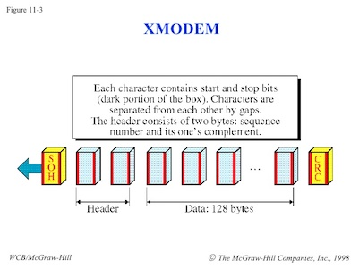

*Lab written by Pat Hanrahan, updated by Julie Zelenski*

## Goals

During this lab you will:

1. Experiment with the linker `ld`, with the goal of understanding what is in
   an object (ELF) file by using `nm`, and how object files are combined to produce an
   executable.

2. Understand how executing programs are laid out in memory.

3. Read and understand the source to the bootloader. It is important to be able
   to read code produced in the wild.

4. Explore the stack and heap in preparation for assignment 4.


## Prelab preparation
To prepare for lab, do the following: 

- Pull the latest version of the `cs107e.github.io` repository.
- Clone the lab repository `https://github.com/cs107e/lab4`.
- Having a solid understanding of the memory layout of your program is essential for your next assignment! In lab 3, you looked at the stack layout, but we recommend making another pass to ensure it all makes sense to you. Read the code in `lab3/code/simple`  and review the three different stack diagrams we made : (1) stopped in the [call to abs](http://cs107e.github.io/labs/lab3/images/stack_abs.html), (2) during a [deep recursive call](http://cs107e.github.io/labs/lab3/images/stack_factorial.html) and (3) a function that declares a [stack array](http://cs107e.github.io/labs/lab3/images/stack_array.html). You will need to have a good understanding of the stack to help
you answer one of today's [checkin questions](checkin).

## Lab exercises

Pull up the [check in questions](checkin) so you have it open as you go.

### 1. Linking

In the first part of this lab, you will be repeating some of the live coding demonstrations shown during lecture on linking and loading.

Let's first review some terminology. An _object file_ (also called an .o file or a relocatable) is the result of compiling and assembling a single source file. An object file is on its way to becoming a full program, but it's not finished. The linker takes over from there to combine the object file with  additional object files and libraries. The linker is responsible for resolving inter-module references and relocating symbols to their final location. The output of the linker is an _executable_ file, this represents a full program that is ready to run.

#### Symbols in object files

`cd` into the `code/linking` folder of `lab4`.

The `nm` program allows us to examine the symbols (i.e. function names, variables, constants, etc.) in an object file. Try it out now:

    $ make clean
    $ make start.o
    $ arm-none-eabi-nm -n start.o

The `nm` output lists the symbols from the object file, one symbol per line line.
What symbols are listed for `start.o`?
What is the significance of the numbers shown in the left column?
What do the single letters `T`, `U`, and `t` in the second column mean?
In another window, you may want
to open `start.s` in a text editor for comparison.

Skim the `arm-none-eabi-nm` [man page](https://manned.org/arm-none-eabi-nm) to learn a little bit about this tool. What are some of the other symbol types you expect to see? What is the significance of upper versus lowercase for the symbol type? What does the `-n` flag do?

*Make sure you and your partner understand `nm`'s
output before continuing.*

Let's now examine the symbols for the other object files.

    $ make linking.o
    $ arm-none-eabi-nm -n linking.o

How many symbols are listed for `linking.o`? 
What do the single letter symbols `D`, `R`, `C`, and `b` mean in the `nm` output?
Open `linking.c` in a text editor and try to match each variable with a symbol in the `nm` output.
Can you find them all? Why are there no stack variables in the symbol list?

What type of symbol do you think the declaration `const int[10]` would be?
Uncomment line 10 in `linking.c` with `const int n_array[10];` recompile `linking.o` and use `arm-none-eabi-nm` to see for yourself!

Finally, let's see what `arm-none-eabi-nm` tells us about the symbols in
`cstart.o`.

    $ make cstart.o
    $ arm-none-eabi-nm -n cstart.o

#### Symbols in an executable

The final build step is to ask the linker to join the object files and libraries into one combined program. The three object files we just examined are linked together to form the executable `linking.elf`.  Use `make linking.elf` to perform the link step.

    $ make linking.elf
    $ arm-none-eabi-nm -n linking.elf

The executable contains the union of the symbols we saw earlier in the three object files. However there has been some rearrangement. What is the order of the symbols in the executable? How have their addresses changed during the link process?
Do any undefined symbols remain?
What happened to the symbols marked `C`?

#### Resolution and relocation

Let's use our .list files to review the assembly to get a better understanding of how symbols are resolved and relocated.

```
$ make start.list
$ more start.list

00000000 <_start>:
       0:   mov     sp, #134217728  ; 0x8000000
       4:   mov     fp, #0
       8:   bl      0 <_cstart>

0000000c <hang>:
       c:   b       c <hang>
```

The third instruction (at offset 8) is where `_start` calls `_cstart`. The *branch and link* instruction `bl` branches to location 0.
Is 0 the address of `_cstart`?

Now let's look at the listing for `linking.elf`, 
and inspect the same code after linking.

```
$ make linking.elf.list
$ more linking.elf.list
 00008000 <_start>:
     8000:       mov     sp, #134217728  ; 0x8000000
     8004:       mov     fp, #0
     8008:       bl      811c <_cstart>

 0000800c <hang>:
     800c:       b       800c <hang>

 00008010 <sum>:
     8010:       mov     ip, sp
     8014:       push    {fp, ip, lr, pc}
           ...
     8118:       bx      lr

 ...

 0000811c <_cstart>:
     811c:       mov     ip, sp

 ...
```

What is the difference between the branch address in `start.o` 
before and after linking?
What did the linker do to change the address?

#### Libraries

Next, `cd` into `../libmypi`.
This directory contains an example of building a library
`libmypi.a` containing the files `gpio.o` and `timer.o`.

Read the `Makefile`.
Notice the lines

    libmypi.a: $(LIBRARY_MODULES)
    	arm-none-eabi-ar crf $@ $^

The `arm-none-eabi-ar` program creates an *archive* from a list of object files.
The flags `crf` mean to create (`c`) the archive,
replace/insert (`r`) the files,
and use the filename (`f`) for the name of the archive.

The library can then be passed to the linker using `-lmypi`.

The linker treats objects files (`.o`) and libraries (`.a`) a little bit differently.
When linking object files, all the files are combined.
When linking libraries, only files containing definitions of
undefined symbols are added to the executable.
This makes it possible to make libraries with lots of useful modules,
and only link the ones that you actually use in the final executable.

### 2. Memory Map

As part of the relocation process, the linker places all of the symbols into their final location according to a _memory map_. Let's take a look at this.
Go back to the `code/linking` folder and use `nm` to see the final locations of all the symbols in the executable.

    $ arm-none-eabi-nm -n linking.elf

In the output, note how symbols of different types (text, data, rodata, etc.) are co-located in memory.

Now open the file `memmap` in your text editor. `memmap` is a _linker script_, which is used by the linker to lay out the executable according to a specification.

- Do you see how the `memmap` linker script specifies how sections from
  individual files are to be combined?

- One of the purposes of `memmap` is to ensure that the global label `_start`
  appears first in the executable file. Why is it critical that this 
  function be first? How does `memmap` specify where `start.o`
  should be placed?

- Another purpose of `memmap` is to setup block storage of uninitialized
  variables. It does this by defining the addresses `__bss_start__` and
  `__bss_end__`. How are those addresses determined? In C, uninitialized
  variables should be set to 0. How does `_cstart` use those addresses to
  initialize the variables to 0?

- Try rearranging some sections of `memmap`. What happens to the arrangement of symbols in `linking.elf`
  if you swap the `.rodata` and `.data`
  sections? What would you have to change to explicitly place `cstart.o` directly after `start.o`?

Our standard linker script will work as-is for most projects, but rather than take it for granted, we'd like you to look the script over and understand its purpose and function. If you're curious to go deeper,
here's some [helpful documentation](https://sourceware.org/binutils/docs-2.21/ld/Scripts.html).

### 3. Bootloader
The _bootloader_ refers to the program that runs on the Raspberry Pi that waits to receive a program from your laptop and then executes it. Back in lab 1, we had you download `bootloader.bin` from our [course firmware](https://github.com/cs107e/cs107e.github.io/tree/master/firmware) folder. You copied `bootloader.bin` to your SD card under the name `kernel.img` so that it became the program that starts up when the Raspberry Pi resets.

Thus far, the bootloader has largely been used a "black box". Now you are ready to open it up and learn how programs are sent from your laptop and execute on the Pi!

The bootloader we are using is a modified version of one written by 
David Welch, the person most
responsible for figuring out how to write bare metal programs on the Raspberry
Pi. If it wasn't for [his great work](https://github.com/dwelch67/raspberrypi), we would not be offering this course!

Your laptop and the bootloader communicate over the serial line via the Raspberry Pi's UART. They use a simple file transfer protocol called XMODEM. In the jargon of XMODEM, your laptop initiates the transfer and acts as the _transmitter_; the bootloader acts as the _receiver_.

#### Transmit: `rpi-install.py`

The  `rpi-install.py` is a Python script that runs on your laptop and transmits a binary program to the waiting bootloader.



The transmitter reads in the binary file to transmit and sends 
the file contents chunked into a sequence of 128-byte packets. Here is the algorithm
used in the transmitter:

1. Start the transmission by sending an SOH byte, which has value
   0x01. SOH is a _control character_ which stands for _start of heading_;
   it indicates the start of a new packet.

2. Send the packet sequence number as a byte. The first packet is numbered 1 and 
   the packet sequence number is incremented after each packet is sent.

3. Send the bitwise complement of the packet sequence number as a byte.

4. Send the next 128 bytes of data. (one packet's worth)

5. Send the checksum of the packet as a byte. The checksum is computed by summing all bytes in the packet (mod 256).

6. Repeat steps 1-5 for each packet. When there are no 
   more packets to be sent, send the EOT character. EOT stands for _end of transmission_ and has value 0x04.

The `rpi-install.py` script leverages python packages that abstract away the details of the XMODEM protocol-handling so there is not much of interest to see in the script itself, but if you're curious, free free to check it out. Use this command to find out where the script is installed on your system and view it:

```
$ less `which rpi-install.py`
```

#### Receive: `bootloader.bin`

The `bootloader.bin` you have installed on your SD card is a C program that runs bare-metal on the Raspberry Pi. Cd to the directory `code/bootloader`. This folder contains the source code to build `bootloader.bin`. This program waits to receives a binary from your laptop which it loads into memory, and then branches to the code to begin execution.

First, read the assembly language file `start.s`.
Note the `.space` directive between `_start` and the label `skip`.
This has the effect of placing the bootloader code
at location `0x200000`.
This creates a hole in memory
(between 0x8000 and 0x200000).
The bootloader loads your program into that hole.
Why can't the bootloader code also be placed at 0x8000?

Now let's look at the algorithm used to receive the XMODEM
protocol, as implemented in the file `bootloader.c`.
This program, which runs on the Raspberry Pi, is the receiver.

It reads bytes by doing the following:

1. **Wait for a SOH (start of heading) byte**

2. **Read the packet number**

   The first block must be packet number 1.
   The packet number of each packet should be incremented
   after each packet is successfully received.
   If the receiver sees a packet with the wrong packet number,
   the receiver sends the control character `NAK`, for
   negative acknowledge, to the transmitter.

3. **Check that the complement of the packet number is correct**

   How does the C code in bootloader check that the complement is correct?
   If the packet number and
   the complement of the packet number are not consistent,
   send a `NAK` to the transmitter.

4. **Read payload while updating checksum**

   Read the 128 bytes comprising the payload of the packet. Each payload byte is copied to memory in sequence.
   Update the checksum to include each byte as it arrives.
   The checksum is formed by adding together (mod 256) all the bytes in the packet.

   How is this done in the bootloader?
   Suppose we send 128 bytes,
   where the 1st byte is 1, the 2nd byte is 2, and so on, until
   we get to 128th byte which has the value 128.
   What is the value of the checksum in this case?

5. **Depending on checksum, send ACK or NAK**

   After 128 bytes have been read,
   read the checksum byte sent by the transmitter.
   Compare that checksum
   with the calculated checksum.
   If they agree, send an `ACK` (acknowledge) to the transmitter;
   if they do not agree, send a `NAK` (negative acknowledge) to the transmitter.

6. **Check for EOT (end of transition) byte**

   If the receiver receives the EOT byte,
   then the transmission has ended.
   Send an `ACK`,
   and then jump to the program memory location.

Where does the bootloader copy the program?
What happens when the bootloader detects an error
which requires it to send a `NAK`?
How does it recover from errors?
Why does it use the timer?

Discuss the bootloader code in detail with your labmates.
Make sure you understand all of it.

Each group is responsible for
writing a description of the C implementation of the bootloader.
Break the description up into parts,
one for each person in your group.
Each person should write a paragraph
describing the part of the implementation assigned to them.
**Collate your descriptions, and hand in the completed writeup to the CA.**

Here is a helpful diagram as you look through the code.


### 4. Runtime stack and heap

`cd` into `code/heapclient` to begin your foray in allocating memory at runtime! 
So far we have stored our data either as local variables on the stack or global variables in the data segment. The functions `malloc` and `free`  offer another option, this one with more precise control of the size and lifetime and greater versatility at runtime.

Inspect the program `string_main.c`. The `tokenize` function is used to 
dissect a string into a sequence of space-separated tokens. The function calls on the not-yet-implemented function `strndup` to make a copy of each token string.

Why can't `tokenize` or `strndup` declare space for
these strings in their stack frames?  What other memory must we use instead?

Implement `strndup` to create a heap-allocated copy of first `n` characters of its argument by calling the `malloc` function from the reference libpi. Test your program to verify your implementation is correct.

The current version of `main` stores the new strings into an array 
that is allocated on the stack. Change `main` to instead allocate this array in the heap. Make sure that your `malloc` 
requests are expressed in number of __bytes__ to allocate. Once the space is allocated (whether as a stack array or pointer to a heap array), note that access to it is functionally identical, array indexing for the win!

How many 
bytes would you need for an array of `n` chars? What if the array
elements were `int` instead of `char`? 

Unlike stack and global memory, which is automatically deallocated on your behalf, you must explicitly free dynamic memory when you are done with it. Edit `main` to add the necessary calls to `free` to properly deallocate all of the dynamic memory it uses.

## Check in with TA

At the end of the lab period, call over a TA to [check in](checkin) with your progress on the lab.

It's okay if you don't completely finish all of the exercises during
lab time; your sincere participation for the full lab period is sufficient
for credit.  If you don't make it through the whole lab, we still highly encourage you to
go through those parts, so you are well prepared to tackle the assignment.
