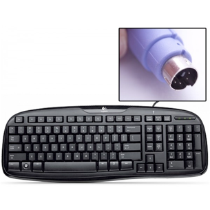

*Lab written by Philip Levis, updated by Pat Hanrahan*

## Learning goals

In your next assignment, you will read PS/2 scancodes from a keyboard and turn
them into ASCII characters. This will allow you to type text that
your Raspberry Pi can process. The goal of the lab is to set up the
keyboard so that you can immediately start on the assignment.

During this lab you will:

1. Install jumpers into PS/2 keyboard mini-DIN connector.
2. Watch the signals from the keyboard using a logic analyzer.
3. Print out the scancodes sent by the keyboard.
4. Write code to decode the PS/2 protocol to produce scancodes.

## Prelab preparation
To prepare for lab, do the following: 

- Pull the latest version of the `cs107e.github.io` repository.
- Clone the lab repository
   `https://github.com/cs107e/lab5`.
- [Download and install the *Logic* application from the Saleae
  web site.](https://www.saleae.com/downloads) This application will visualize the signals captured by the logic analyzer.
  You may also want to download the 
  [user manual](http://downloads.saleae.com/Saleae+Users+Guide.pdf).

## Lab exercises

Pull up the [check in questions](checkin) so you have it open as you go.

### 1. Add a PS/2 port to your Raspberry Pi (20 min)

Most modern keyboards are USB keyboards.  Unfortunately, the USB
protocol is complicated; it's approximately 2,000 lines of code to
interface a USB keyboard to the Raspberry Pi.  Instead, we will
interface with a PS/2 keyboard, which uses a simple serial protocol
that is easy to decode.  The PS/2 keyboard appeared on the original
IBM PC.

There are two common PS/2 devices: a keyboard and a mouse.  PS/2
devices connect to a PC using a 6-pin
[mini-DIN connector](https://en.wikipedia.org/wiki/Mini-DIN_connector).
The convention is a mouse uses a green connector  and a keyboard uses a
purple connector.

Get a keyboard from a TA. You can use this keyboard during the quarter,
but we would like you to return it at the end of the course.
Inspect the inside of the keyboard connector,
you will see that it contains a plastic tab (that forces you to 
plug it in with the correct polarity) and 6 male pins.
Two pins are NC (not-connected), and the others carry VCC, GND, DATA and CLK.

You are going to solder an expansion board for your Pi that lets you
plug in a keyboard directly. There's a limited number of solder stations
in lab, so you'll need to take turns (or come by some other time).
[Instructions to do this are at the end of the lab writeup.](#board)

Until you have made the expansion board, you can jury-rig your
keyboard as follows. Insert four female-to-female jumpers into
the mini-DIN connector. Use the following convention: red for VCC,
black for GND, yellow for DATA, and white for CLK.
These are a tight fit, so you will have to force them in.
The good news is that once they are in, they are unlikely to fall out.

If the pins inside the connector are bent, feel free to try straightening
them with pliers -- or ask a staff member for a replacement keyboard.

### 2. Use a Logic Analyzer to visualize the PS/2 protocol (30 min)

We will use the Saleae Logic Analyzer to examine the signals 
being sent by the keyboard -- please do this in groups of 2 or 3
so we have enough logic analyzers to go around.

First, launch the *Logic* application you installed from the prelab section; you should see
a screen similar to the following:

Second, familiarize yourself with the logic analyzer. One side has a USB
port, and the other side has the jumpers. This logic analyzer can
simultaneously watch 8 channels.

Each channel has a pair of jumpers; one for signal, and the other for
ground. In this lab, we will be watching the channels DATA and CLK 
from the keyboard.

Third, connect the logic analyzer to the keyboard.
Connect one side of a white male-to-male jumper 
to channel 0 of the logic analyzer
and the other side to the CLK jumper coming from the keyboard.
Similarly, connect a yellow male-to-male jumper 
to channel 1 and the DATA jumper.

Fourth, plug the female-to-female GND and VCC jumpers 
into the 5V and GND pins on your Raspberry Pi.

The ground line for each channel is directly underneath its signal
wire. Recall from lecture that you need to ground each channel to the
Raspberry Pi to complete the circuit otherwise it can have erratic
behavior. To do this, connect these ground lines to the ground pins on
your Raspberry Pi. Since your keyboard is also connected to the Pi,
the two devices actually share the same ground line! Connect the
Saleae USB cable to the USB port of your computer.

This is what it looks like wired up. 

Fifth, configure the logic analyzer to acquire the signal.

To access the setup options, click the up/down arrow button to the
right of the green "Start". Use a sampling rate of at least 1 MS
(megasample) per second and instruct it to record several seconds of
samples.  You may also want to set the trigger so that the logic
analyzer starts recording when the CLK signal (channel 0) is
falling. Configure a trigger for a channel by clicking the button
labeled with "+ wave".

Once you have the logic analyzer configured, start it and
type on the keyboard. The logic analyzer should pop up a dialog
saying that it is capturing data.  After a few seconds it should
return and display the data it collected.  You can zoom in and out and
pan left and right to see the details of the captured signal.
You should see the characteristic pattern of the PS/2 protocol.

The Logic application supplies common analyzers that can be applied to
the captured data. Explore the *Analyzers* interface on the right and see
what analyzers are available. Find the PS/2 analyzer and enable it.
Setup the analyzer so that the CLK is channel 0 and the DATA is
channel 1. The captured data is now decoded according to the PS/2
protocol and it will display the hex values sent by the keyboard.

### 3. Test the Keyboard and the Pi (20 min)

Next, disconnect the keyboard from the logic analyzer and connect it
to the Raspberry Pi.  Connect the white jumper (CLK) to GPIO23
and the yellow jumper (DATA) to GPIO24.

Here is what it should look like if everything is connected
up properly.

At this point, you should have a keyboard connected to the Raspberry Pi.
Let's test it using the program showed in class.

    % cd code/keyboard_test
    % make
    % make install

Type different keys and you should see the scan codes printed
on your screen. If they are regular alphanumeric keys, you should
also see the ASCII key code. If you don't see them, check your wiring.

As you saw with the Saleae, scan codes are not ASCII
characters. Instead, they have values that relate to their physical
placement on the keyboard.  Inside the keyboard, there's a 2D matrix
of wires that generates the scancode bits. 

When you press a key, the
PS/2 keyboard sends a scan code. When you release that key, it sends
another scan code. This release scan code is the same as the first one, except
it is one byte longer: it has a leading 0xF0. So pressing `z` will
cause the keyboard to send scan code `0x1A`. Releasing `z` will cause
the keyboard to send scan code `0xF0` `0x1A`. 

If you hold down `z` long
enough, the keyboard will send multiple press scan codes
(auto-repeat). For example, if you press `z`, hold it until it
repeats, then release it and press/release `g`, the scan codes
received will be `0x1A`, `0x1A`, `0xF0` `0x1A`, `0x34` and `0xF0` `0x34`.

Try slowly typing single letters to observe the scan codes for press, 
release, and auto-repeat. Then try typing some special keys like shift.

* What sequence of codes do you see when you type (capital) `A`? 

* What does this tell you about how your code will handle Shift or Control?

### 4. Write code to receive scancodes (40 min)

As a final step, you'll write your own code to receive scan code bytes
from the keyboard. You'll do this in lab because it touches on both
hardware and software, so it can be tricky to debug; it helps to
have staff around!

Go to the `code/keyboard` folder in this lab. This is a variant of the
same application in `code/keyboard_test`, except that rather than
using the reference implementation of the keyboard driver, it uses the
one in `keyboard.c`, which you will fill in now!

Open up `keyboard.c` in your text editor. For the rest of lab, you
will fill in code here in `keyboard.c` so that the test application in
`main.c` works.

The function `keyboard_init` has already been written for you. It
configures both the clock and data lines as input and sets them to be
pull up, so if the keyboard isn't plugged in they will default to
high.

We've also provided a tiny helper function,
`wait_for_falling_clock_edge`. This waits until the clock line has a
falling edge, which indicates the keyboard driver should read data.

Fill in the function `keyboard_read_scancode`.

This function should wait for 11 clock cycles: a start bit (which must be
low), 8 data bits, a parity bit, and a stop bit (which must be
high).

Wait, quick knowledge check: in which order do the data bits arrive?

If you want to sort out the details of the PS/2 protocol,
you might find these helpful:
[PS/2 protocol explanation](http://www.computer-engineering.org/ps2protocol/)
linked to as reading, 
and [the lecture slides from Monday](http://cs107e.github.io/lectures/Keyboard/Keyboard.pdf).

This function returns the 8 data bits of a correctly received PS/2 byte.
It's important that you check that the start bit is low.
Otherwise it's possible for your driver to become desynchronized and
never read correct PS/2 scan codes.

In your assignment, you will also check the parity and stop bits,
but you don't need to do this for lab.

If something is wrong with the data you're getting over the line 
(just a wrong start bit for this lab),
your code should restart at the beginning of a scancode.
It shouldn't return until it correctly reads in a scancode.
So if the start bit is not 0,
then your code should wait for a start bit again. 
Think about how you might structure your code such that if the parity bit is wrong, you can easily wait for a start bit again.

As you're implementing your function, notice how having the
`wait_for_falling_clock_edge` function makes the code easier to read 
than writing out those two while loops. When you see a few lines of code replicated many places in your program, that's often a good sign you want to pull it out into a function.

If your `keyboard_read_scancode` is working correctly, then you should
be able to compile the application and see that it can report each scan code received from the keyboard.

Your final task is to fix `keyboard_read_sequence` to recognize when a scan code is not a standalone action, but instead part of a larger sequence, such as the two scan codes sent together for a key up action. Review the PS/2 documentation to see the format of those two and three-byte sequences and then edit the body of `keyboard_read_sequence` to fill the sequence array 1, 2, or 3 scan codes as appropriate and return the number of codes written to the array.

If your `keyboard_read_scancode` and  `keyboard_read_sequence` are working correctly, then you should be able to compile the application and have it act identically to
the test version.

## Check in with TA

At the end of the lab period, call over a TA to [check in](checkin)
with your progress on the lab.

Before leaving lab, make sure your `keyboard_read_scancode` is working
in the last section of lab. If you haven't made it through the whole
lab, we still highly encourage you to go through the parts you skipped
over, so you are well prepared to tackle the assignment.

## Making your PS/2 expansion board

To make your expansion board, you'll need seven things:

  1. The printed circuit board (PCB)
  1. A mini-DIN connector for the PS/2 keyboard
  1. A 1kOhm resistor
  1. A click button
  1. Four header pins
  1. A soldering iron and solder
  1. A pair of pliers/snips
  
Here's a picture of the parts, minus the pliers/snips:

The circuit for the board is very simple. It has 4 pins, labeled
on the left side: 5V, Data, Clock, and Ground. All four pins connect
to the mini-DIN socket for the keyboard, so that the keyboard's signals
can be connected to your Pi via a breadboard. The 5V signal is
controlled by the button. When the switch is up, the board applies
power to the keyboard and the LED on the switch so you know it's powered.
When you press the switch down, it breaks the circuit, cutting power to
the keyboard. This lets you reset the keyboard.

Turn on the soldering iron to power level 8. Put water in the sponge if it
is dry. Wait until the green light flickers, showing the iron is hot.

The first step is to solder the header pins. A good joint will have
the solder turn silvery and run into the hole (you'll see it suck
in). Be sparing with the solder at first and be careful you don't have
a big blob on your iron.  It's much easier to add a bit more than
remove some when you have too much.  If you have too much then you
might accidentically connect (short) two pins when the solder runs
between them.

You want the pins with the long side down. The black plastic should be on
the bottom of the board, such that the short ends of the pins just
stick above the board a little. Stick the four pins through the four
holes, situating it so they are straight. Put your soldering iron
right next to one of the pins. Gently put solder alongside the pin,
then touch the soldering iron to it. The solder should melt. Keep it
close to the hole, so it is sucked into the joint. Once the pin is
held a little bit by the solder, you might want to re-melt it so you
can straighten the pins. Once they are straight and the solder is
holding them in place, solder each pin.

Once you have soldered the pins, thread the resistor through the
two holes in the board, so its wires stick out the bottom. Make sure
it is flush with the board and the wires go tightly though the holes
(no big loops on top). Solder the two joints.
Your board should now look like this.

Trim the extra wire off the resistor.

Slot the mini-DIN connector into your board. Using the pliers, bend the
three metal tabs so the component is held tightly in place, like this:

Solder all five pins. If you are right handed, it can be easier to do
them left to right, so the soldering iron isn't ever hovering near a
finished joint. Slot in the button: make sure you have oriented it as
the drawing on the top of the board indicates. Solder the six pins.
Your board should now look like this:

Trim any long wires or pins poking out. You're now ready to plug this
board into your breadboard, and then connect the pins to your Pi with
jumper cables. Use the following convention: red for 5V, black for
GND, yellow for DATA, and white for CLK.
