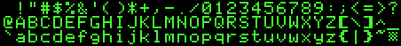

*Lab written by Philip Levis and Pat Hanrahan*

## Goals

In the next assignment,
you will complete the framebuffer module, 
build a basic graphics library,
and create a text console.
Using your keyboard and console code
you will be able to run your shell 
standalone on the Pi without your laptop.

The goal of the lab is review concepts and code
that you will need to complete assignment 6.
During this lab you will:

1. Connect your Raspberry Pi to a monitor and generate video
2. Read and understand the mailbox and framebuffer code
3. Review C syntax for pointers to multi-dimensional arrays
4. Read and understand fonts and the representation of characters

## Prelab preparation
To prepare for lab, do the following: 

- Pull the latest version of the `cs107e.github.io` repository.
- Clone the lab repository `https://github.com/cs107e/lab6`.

## Lab exercises

### 1. Connect your Raspberry Pi to a monitor (5 min)

The first step is to connect your Raspberry Pi to a monitor.
To do this, you need an HDMI cable and an HDMI-to-DVI adapter. (The monitors we are using are older and do not have HDMI connectors).
Attach the HDMI-to-DVI adapter to the monitor's DVI port and
connect the HDMI cable to the adapter and the HDMI port on the Raspberry Pi.
Power your Raspberry Pi, and you should see the following.


Now test the GPU on the Raspberry Pi.
Go into the directory `code/grid`.

     $ make

Reset your Pi, and then type

     $ make install

Once it reboots, you should see a grid on the monitor.

### 2. Draw pixels on your screen (40 min)

Modify the `grid.c` file in the following three ways:

1. Change the video resolution to 1024 by 768, and redraw the grid.

2. Change the grid code to draw horizontal lines in red and vertical lines in yellow.

3. Change the grid code to draw a checkerboard pattern 
   (alternating filled black and white squares).

### 3. Study the fb and mailbox code (30 min)

#### The GPU mailbox

Recall from [lecture](/lectures/Framebuffer/Framebuffer.pdf) that the
CPU communicates with the GPU by sending messages using a *mailbox*.
The CPU sends a message by storing a memory address to that message in the mailbox.
When a message is placed in the mailbox, it is considered *full*.
When the message is read by the GPU, it becomes *empty*.

Overall, this is the communication pattern we'll be using:
* The CPU starts this exchange by creating a message 
  and putting a pointer to that message in the mailbox.
* When this happens,
  the hardware alerts the GPU,
  which reads the message.
* After processing this message,
  the GPU responds by putting a return message in the mailbox 
  (filling it again) for the CPU to read.
* Meanwhile, the CPU is waiting until the mailbox becomes full with a message;
  once it is full the CPU reads the return message from the GPU.

#### Using the mailbox to configure the framebuffer

To configure the framebuffer,
we use the mailbox to send a _framebuffer configuration message_ 
to the GPU.

The message sent by the CPU contains the physical
and virtual sizes of the framebuffer,
as well as the depth of the pixels.
The physical size describes the size of the screen on the monitor.
The virtual size describes the image containing the pixel data,
which can be different than the physical size of the screen.

The GPU's reply message includes 
a pointer to the start of the framebuffer,
the total size in bytes allocated to the framebuffer,
and the length of each scanline or row of the framebuffer
(this is called *pitch*).  The pitch is greater than or equal to
`width` multiplied by the size of a pixel in bytes.
It can be greater than so that the GPU can add some padding at
the end of each row in order to align them.
The pitch is equal to the size of the row plus the padding.
The CPU sets these fields (`size`, `pitch`, and `framebuffer`) to 0
when it sends the configuration message to the GPU: the GPU
responds with the correct values.

Your code should check that the framebuffer
was configured properly by checking that the GPU's reply message has
the same physical and virtual sizes that you sent.
Otherwise, you might have specified a size that the GPU doesn't support,
and your graphics won't work properly.

If the framebuffer is configured correctly, the GPU's reply message
will include a pointer to the image comprising the *framebuffer*.
This is a contiguous block of memory 
that you can read and write to read and write pixels.
The GPU will continuously display the contents of the framebuffer.
If you change the framebuffer,
the display will be updated automatically.

Now let's take a look at some code that does this!
Change into the directory `code/fb`. That directory contains the files:

    $ ls
    Makefile	fb-main.c	fb.h		mailbox.h	start.s
    cstart.c	fb.c		mailbox.c	memmap

The `fb.c` contains the function `fb_init()` that was shown in class.
This function configures the `fb_config_t` structure 
(the framebuffer configuration message),
and sends it to the GPU using `mailbox_write` and `mailbox_read`.
These mailbox functions are defined in `mailbox.c`.

Read and discuss the code in `fb.c` , `mailbox.h`, and `mailbox.c`
with your lab neighbors. Discuss each of these questions as a group. Some questions 
will also be included in the check in.

   1. Why does the code need each of the checks for whether the mailbox is `EMPTY`
      or `FULL`? What might go wrong if these checks weren't there?

   2. Why can we add the `addr` and `channel` in `mailbox_write`?
      Could we also `|` them together?
      What bit positions are used for the `addr` and what for the `channel`?

   3.  Draw a memory map diagram of where `fb`, `mailbox`, and the framebuffer live.
      Clearly mark where the CPU's memory and GPU's memory are, as well as
      non-RAM device registers.  Recall that your Pi is configured to give the 
      bottom 256MB of memory (0x00000000 - 0x0ffffffff) to the CPU and the top 256MB 
      (0x10000000 - 0x1fffffff) to the GPU.  Do `fb`, `mailbox`, and the framebuffer live 
      in GPU or CPU memory?   Which of these
      data structures can our CPU code choose where to allocate, and which are given to us?

   4. Go to the directory `code/volatile`. This contains a slightly
      modified version of the code from the `fb` directory. The Makefile is modified to
      create two versions of `mailbox.c` each: a version that marks the mailbox
      as volatile, and another version that does not make them volatile.
      Compare the assembly for the two implementations of mailbox.c after running `make mailbox.list` in each directory.
      How do they differ? What happens to the first loop branch in the read or write operations? Why?

### 4. Multidimensional pointers (30 min)

Pointers are one of the hardest concepts in C.
The goal of this part of the lab is to review basic pointer declarations,
in particular,
pointers to multidimensional arrays
to better prepare you for the assignment.
One convenient way to represent
images is with a multidimensional array.
The framebuffer memory region
can be managed as a multidimensional array,
which can be much easier
than explicitly calculating offsets into a one-dimensional array.

To start, here is a quick self-test:

* What is the difference between the following two lines of code?
  Think about what operations you can do to one versus the other.

      char *a = "Hello, world\n";
      char a[]= "Hello, world\n";

* What is the difference between the following two declarations?

      int *p[2];
      int (*c)[2];

  You may find **[this website](http://cdecl.org/)** helpful in demystifying
  the meaning of various C declarations.

* Inspect the code in `code/pointers/pointers.c`.
  Compile this code using `make`, run it on your Pi, and interpret the results.


### 5. Fonts (15 min)

A major part of your assignment will be to draw text on the screen.
In order to do this, you need a *font*.



This is a very famous font: can you identify what computer it's from?
In the provided font library, the characters are stored in a single
image that's a little different from the image above.
The characters are stored in a single line (not 3).
The first character stored on the left is '`!`', whose ASCII value is 33 (0x21).
The last character is ASCII value 127 (0x7e), delete, which is displayed as the little checkerboard.
The font contains 95 characters in total.
The characters are all the same size,
14 pixels wide and 16 pixels tall.
This is termed a *fixed-width* font.
The character `' '` (space) is ASCII value 32 (0x20) 
and is handled specially (since it draws nothing).

Take a look at the files `font.h` and `font.c` (these files are published in the [cs107e include and src](https://github.com/cs107e/cs107e.github.io/blob/master/cs107e/) directories).

The file `font.h` declares a C struct for representing a font and the `font.c` contains the above image as a C struct.

```
/* from font.h */
typedef struct  {
    unsigned char first_char, last_char;
    unsigned int  char_width, char_height;
    unsigned char pixel_data[];
} font_t;
```

```
/* from font.c */
static const font_t font_default = {
    0x21, 0x7F, 14, 16, {
    0x0c, 0x00, 0xcc, 0x03, 0x30, 0x03, 0x00, 0xf0, 
    0x00, 0xc0, 0x00, 0xc0, 0x03, 0x00, 0x0c, 0x00, 
     ...
    0xfc, 0x00, 0x00, 0x00, 0x00, 0x0c, 0x00, 0x00, 
    0x00, 0x00, 0x00, 0x00 }
};
```

This format stores the characters as a bitmap:
in a bitmap each pixel is either on or off and is represented by a single bit.
'On' means it is drawn in the foreground color,
'off' means it should be set to the background color.
`font.c` stores this information as a bitmap 
rather than RGBA because it takes (32 times) less memory.
This makes programs using fonts much smaller,
and hence faster to upload to your Raspberry Pi.

Each line of the image is 1330 pixels long (95 characters * 14 pixels wide),
so we use 1330 bits for each line.
The pixel data of the image is represented 
as an array of `unsigned char` with values written in hexadecimal.
For example, the first two bytes in the pixel data array are `0x0c, 0x00`.
Group the 8 bits from the first byte and 6 bits from the second to form the 14-bit sequence `0b 00001100 000000`.  These 14 bits correspond to the top row of the first character, which is an exclamation point. The vertical line for the exclamation point is 2 pixels wide and positioned slightly off-center to the left.

Here's what the actual image looks like,
using green to display an 'on' pixel in the bitmap.
We generated this BMP file directly from `font.c`:


* Talk with your neighbor: why does pixel_data have size `95 * 14 * 16 / 8`?

The key function is `font_get_char()` which copies a single character
from the font image into a buffer. It transforms the bits of the image into an array of bytes, one byte per pixel. Read this function carefully,
since you will use it in the next assignment.

## Check in with TA

At the end of the lab period, call over a TA to [check in](checkin) with your progress on the lab.

If you haven't made it through the whole lab, we still highly encourage you to
go through the parts you skipped over, so you are well prepared to tackle the assignment.
