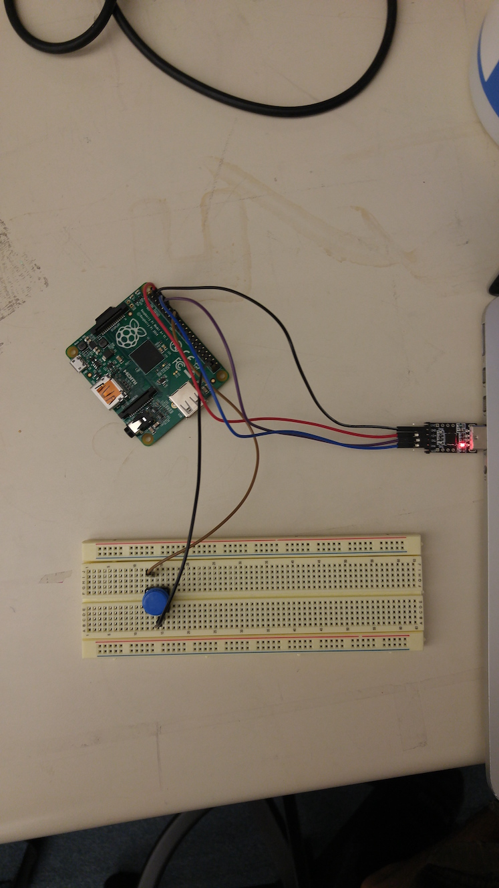

*Lab written by Philip Levis, updated by Pat Hanrahan*

## Learning goals

During this lab you will:

1.  Enable GPIO event interrupts on your Pi.
2.  Optimize the function `strcpy`. (And perhaps feel the adrenaline rush!)

We've provided several support libraries (GPIO event handling, timers,
interrupt initialization, etc.) to make this easier. Look at what's available
to you before getting started so you don't have to repeat work. The goal of the
lab is for you to get experience with enabling interrupts and having them
interact with your main loop.

## Prelab preparation
To prepare for lab, do the following:

- Pull the latest version of the `cs107e.github.io` repository.
- Clone the lab repository `https://github.com/cs107e/lab7`.

You will be using your Pi, a breadboard, and two buttons in this lab.

## Lab exercises

Pull up the [check in questions](checkin) so you have it open as you go.

### Interrupts

#### 1) Review interrupts code (30 min)

Go to `code/interrupts`.
We've provided you with several files to
build on, copied from the reference implementation of libpi.
With your lab-mates, read through the code,
starting with `start.s`, then
`cstart.c`, and then `button.c`. 
Afterwards, answer the questions below.
This code should be familiar from lecture.

+  What assembly function (in `start.s`) does your Raspberry Pi boot into and
    what does it do?

+  What function does this function call, and what does that function do?

+  How does the starter code know how long the interrupt table is and safely
    copy it (and nothing more, nothing less) to 0x0?

#### 2) Set up a button circuit (15 min)

Set up a simple, one button circuit
such that the button's output feeds into GPIO pin 25.
What we want is for the pin to default to being high (1).
When we press the button, it should go low (0).

The way to do this is to make the pin have a "pull-up resistor".  (We won't use a *physical* resistor; instead, we'll tell the Pi to set one up for us.) This means that when the pin is in an open circuit (the button is not pressed), it will default to a value of 1.  When the button is pressed, we want to close a circuit that connects the pin to ground, so it will read a 0. This is like what the PS/2 keyboard does.  You should simply need to connect one side of the button to ground, and the other side of the button to GPIO pin 25.

Next, implement the `button_init` function in `button.c`. 
The function should start by setting GPIO pin 25 as an input 
and setting the pull-up on the same pin.
Look at your `keyboard.c` code to remember how you configured the gpio pins used for your keyboard driver.

Implement a `button_test` function.
This function goes into an infinite loop. On each loop iteration it will:

+ Wait for a falling edge.
That is, wait until the pin goes from 1 to 0 
(checking its state with `gpio_read`).
This waits for the button to be pressed down.

+ Once the button is pressed down,
print a `"+"` using `printf` to report that the button was pressed.

+ Then wait until the pin is 1 again (that is, wait until you've
released the button).

Insert a call to `button_test` before the while loop in `main`.

Compile the program and run it on your Raspberry Pi. Ensure that
`button_test` works. Note that you'll likely get more than one "button
press" per physical button press. Why do you think this might be? When
you're done, double check your understanding.

1. Name two disadvantages, and one advantage, that the spin-loop implementation
   of detecting button presses has or would have over an interrupt-based
   implementation.

2. Do you record (i.e., detect in code) one button press per physical button
   press? If not, why might this be?

#### 3) Write an interrupt handler! (30 min)

Remove the call to `button_test` in `main`.
Make sure you're still calling `button_init` to configure the pin as input 
with a pull-up resistor.

Before being able to handle interrupts, you'll need to configure your Pi so
that a falling edge on GPIO pin 25 will trigger an interrupt.
We've already written this code for you in `setup_interrupts`:
you simply need to call it.
Ensure you understand what every line does and why it's necessary. 

Make a `static int` counter named `cnt` in your `button.c`. Your interrupt
handler is going to increment `cnt`. Your main loop will have an
infinite loop that reads `cnt`, compares to the last read value of `cnt`,
and prints the new value if it has changed. 

1. Should `cnt` be declared volatile? Why or why not? Can the compiler tell,
by looking at only this file, that your interrupt handler function is
called within an interrupt handler?

Now write the interrupt handler `button_press`. The key job of the interrupt handler is check whether this event is indeed the one this handler is intended to process and if so, it should process the event and clear the interrupt. 

Open the `cs107e/include/gpioextra.h` header file to see the available gpio event functions and review the documentation. Which function(s) can be used to check the event status? Which function(s) can be used to clear the event status?

Implement your interrupt handler to process the event by incrementing the counter `cnt`. In `main`, write an infinite loop that reads the value of
`cnt`, compares to the last known value, and uses `printf` to print the value whenever it changes.

Compile and run your program. Ensure that it works as expected. That
is, that the counter increments ~once per button press and that the
counter is printed when it is incremented by the interrupt handler.

Now, edit your interrupt handler to comment out whatever call you are using to clear the event status. Compile and run the program and see how this changes the program's behavior. What changes and why?

When you're done, discuss and answer the following questions with your 
neighbors.

1. Describe what is done by each line of code in the `setup_interrupts` function. What would be the effect of removing that line?

2. What happens if the interrupt event is not cleared before returning from the
   handler?

#### 4) Use a ring buffer (10 min)

The Makefile links in the reference implementation of the ring buffer code 
in `libpi` 
so that you can call our `rb_enqueue` and `rb_dequeue` 
functions to enqueue and dequeue from a ring buffer of integers. 
The `cs107e/include/ringbuffer.h` file declares these functions.

Instead of simply incrementing a counter in the interrupt handler,
call `rb_enqueue` with the counter's value on each update.
Whereas `main` used to directly read the counter and compare to previous value, change the code to instead call `rb_dequeue` to get each update. 

Read `ringbuffer.h` to understand how its functions work.
Note that the first argument to these functions
should be a pointer to a ringbuffer.
This is declared as `rb_t* rb` and initialized by calling `rb_new`.

Recompile and ensure that your code works exactly as before.
When you're done, take a moment to verify your understanding:

1. Why might you want to enqueue/dequeue and then return instead of just doing
   arbitrary logic (like drawing on the screen) in the interrupt handler?
2. Why is the significance of the return value from `rb_dequeue`? Why is it essential to pay attention to that return value?

#### 5) Add a second interrupt (15 min)

Add a second button circuit to your breadboard, another copy of your first button circuit. Connect the two buttons to two different GPIO pins. Configure your Pi so it has an interrupt on either a falling or rising edge of either GPIO pin -- that is, whenever the state of either button
changes.

In the interrupt handler, determine which pin had the event by checking for a return value of 1 for `gpio_check_and_clear_event` on that pin.  Maintain
a separate counter and ring buffer for each button. For each time a button is pressed or
released, increase its counter by 1 and enqueue the current count on its ring buffer.

Edit your main loop to display each update from either button. How can you determine which ring buffer has received an update? 

When you're done, we
have a few questions for you to think about!

1. By how much does a counter increment on a button press or
release? Does this number seem higher or lower than the actual number
of times you pressed buttons?

2. Why does releasing the buttons cause your counters to
   increase? Suggest a reason why it might not match up with how many times
   you press or release the buttons.

### Need for Speed (20 min)

As a fun bonus exercise, let's take a look at what you can do when you're done
writing correct code: optimization. With this, your code can start moving
wickedly fast -- seriously.

Change directory to `code/speed` and review the source in the `speed.c`
file.

The program implements `strcpy`, the function to copy a string from
the standard C library, along with a little timer scaffolding to count the
ticks during the function's execution. You can 
refresh yourself a little on `strcpy` and related string
library functions by typing in `man strcpy` into your terminal.

The given version works correctly, but is naive to a fault. Build the
code as given, install it to the Pi, and run it to get a baseline tick
count. *It is possible to gain more than a 1000x speedup over the
starter version!*

Take a stepwise approach, so you can measure the effect of a given
modification in isolation:

1. **Copy the starter function into a new version and make a single change.** For example, copy `strcpy1` and rename it `strcpy2` before proceeding.

2. Make a rough prediction about the expected performance gain from that change.

3. Now run and time the new version to see whether your intuition matches
   the observed reality. Where the results surprise you, examine the
   generated assembly to see if you can figure out why there is a different
   effect than you expected.

Repeat
this process, each time advancing from the best version so far and
making another small change.

You may assume that the string buffers our `strcpy`
functions will process are multiples of 16 bytes in size and are
16-byte aligned.

Below are some suggested avenues to explore:

+ Little may you know, the first improvement doesn't even involve changing `speed.c`!
Edit the Makefile to enable various levels of compiler optimization and
rebuild and re-run. What difference do you observe between `-O0`, `-Og`, `-O2` and
`-Ofast`? Pick the best setting and let's see how much you can add to what `gcc` can
do.

+ As the second improvement, that call to `strlen` inside the loop has gotta go!
Hoist it out to earn a shockingly large gain. It's not the function call
overhead that is so high (i.e. inlining `strlen` would not help much if at all),
this is actually a big-O problem: recalculating the string length each
iteration makes the copy function run in quadratic time instead of linear --
ouch! Most optimization focuses on reducing the constant factors for an algorithm
with a given big-O, but if you can restructure into a better big-Oh, that is
generally a much bigger win.

+ Next think about where the function spends time. Recall that each instruction 
takes a cycle: are there ways to change the function so that it does the 
same work with fewer instructions? Take a look at the assembly to see where
the effort is going. In the starter implementation, only a small fraction
of the instructions actually copy the string: the rest are incrementing, 
branching, etc. How could you change the loop to issue fewer of these
overhead instructions?

How big of an improvement were you able to make overall?

## Check in with TA

At the end of the lab period, call over a TA to [check in](checkin) with your progress on the lab.

